---
## Author
author:
  name: Полина Вячеславовна Белакова
  degrees: DSc
  orcid: 0000-0002-0877-7063
  email: 1032252589@rudn.ru
  affiliation:
    - name: Российский университет дружбы народов
      country: Российская Федерация
      postal-code: 117198
      city: Москва
      address: ул. Миклухо-Маклая, д. 6
## Title
title: Презентация по лабораторной работе №2
license: CC BY
date: today
date-format: "YYYY-MM-DD" # Example: 2025-09-06
---

# Информация

## Докладчик

:::::::::::::: {.columns align=center}
::: {.column width="70%"}

  * Белакова Полина Вячеславовна
  * Студентка группы НКАбд-01-25
  * Российский университет дружбы народов им. П. Лумумбы
  * [1032252589@rudn.ru](mailto:1032252589@rudn.ru)

:::
::: {.column width="30%"}

:::
::::::::::::::

## Актуальность

- Система контроля версий является неотъемлемым инструментом современной разработки, обеспечивающей недежное хранение кода и командную работу.

## Цели и задачи

- Изучить идеологию и применение средств контроля версий.
- Приобрести навыки работы с git.

## Теоретическое введение

Системы контроля версий (Version Control System, VCS) применяются при
работе нескольких человек над одним проектом. Обычно основное дерево про-
екта хранится в локальном или удалённом репозитории, к которому настроен
доступ для участников проекта. При внесении изменений в содержание проек-
та система контроля версий позволяет их фиксировать, совмещать изменения,
произведённые разными участниками проекта, производить откат к любой
более ранней версии проекта, если это требуется. Среди классических VCS
наиболее известны CVS, Subversion, а среди распределённых — Git, Bazaar,
Mercurial. Принципы их работы схожи, отличаются они в основном синтакси-
сом используемых в работе команд. Система контроля версий Git представляет
собой набор программ командной строки. Доступ к ним можно получить из
терминала посредством ввода команды git с различными опциями. Благодаря
тому, что Git является распределённой системой контроля версий, резервную
копию локального хранилища можно сделать простым копированием или
архивацией

# Выполнение лабораторной работы

## Установка программного обеспечения

Установила git([рис. @fig-001]).

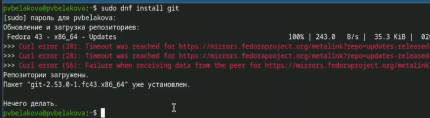{#fig-001 width=70%}

Установила gh ([рис. @fig-002]).

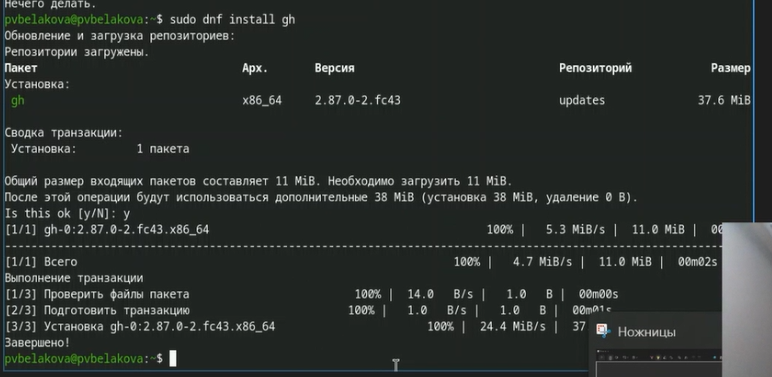{#fig-002 width=70%}

## Базовая настройка git

Зададаю имя и email владельца репозитория ([рис. @fig-003]).

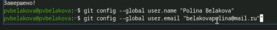{#fig-003 width=70%}

Настраиваю utf-8 в выводе сообщений, верификацию и подписание комми-
тов git, зададаю имя начальной ветки, настраиваю параметры autocrlf, safecrlf
Установила gh([рис. @fig-004])..

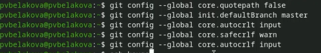{#fig-004 width=70%}

Создаю ключи ssh ([рис. @fig-005]).

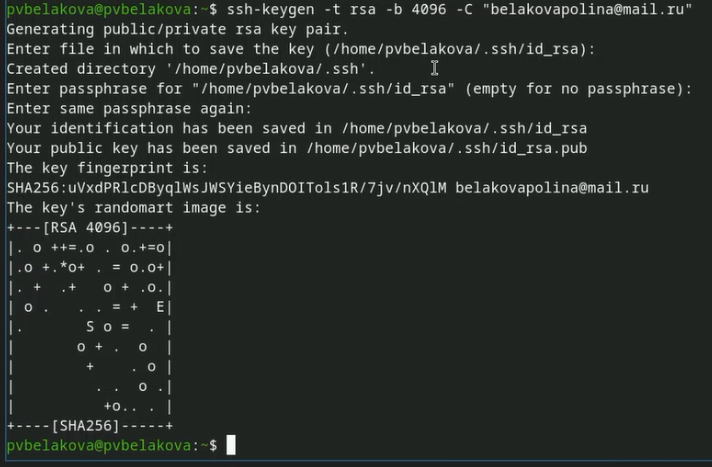{#fig-005 width=70%}

Создаю ключи pgp([рис. @fig-006]).

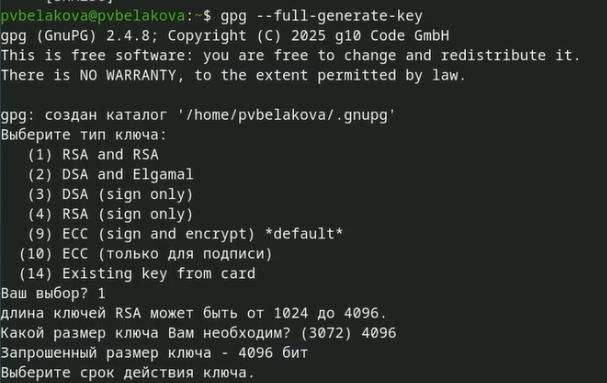{#fig-006 width=70%}

## Настройка github

Добавляю PGP ключ в GitHub([рис. @fig-007]).

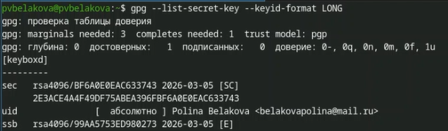{#fig-007 width=70%}

Копирую сгенерированный PGP ключ в буфер обмена ([рис. @fig-008]).

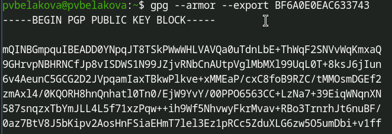{#fig-008 width=70%}

Перехожу в настройки GitHub, нажимаю на кнопку New GPG key и вставьте
полученный ключ в поле ввода ([рис. @fig-009]).

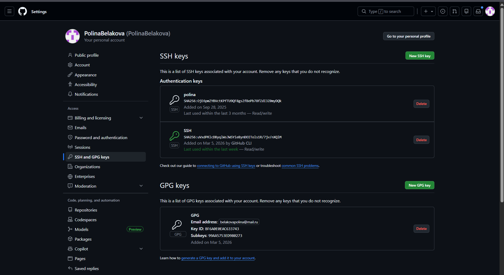{#fig-009 width=70%}.

## Настройка gh

Авторизоввываюсь с помощью команды gh auth login ([рис. @fig-011]).

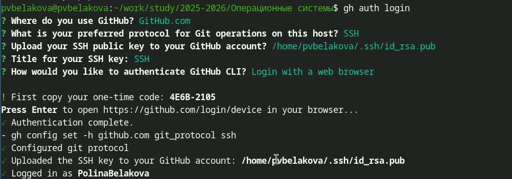{#fig-011 width=70%}

## Шаблон для рабочего пространства

Создаю дерикторию ([рис. @fig-012])и репозиторий курса на основе шаблона([рис. @fig-013]).

{#fig-012 width=70%}

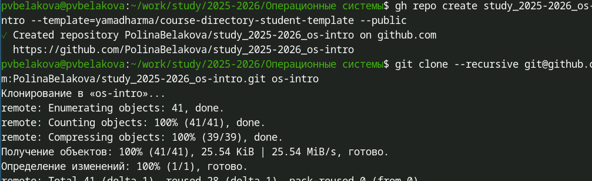{#fig-013 width=70%}

## Настройка каталога курса
Перехожу в каталог курса, удаляю лишние файлы ([рис. @fig-014]), создаю необходимые каталоги ([рис. @fig0014])

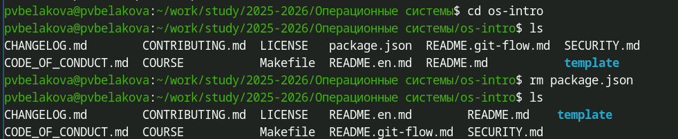{#fig-014 width=70%}
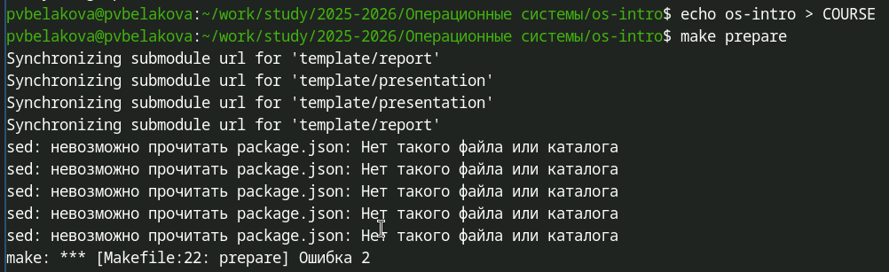{#fig-015 width=70%}
Отправляю файлы на сервер ([рис. @fig-016]), ([рис. @fig-017]).

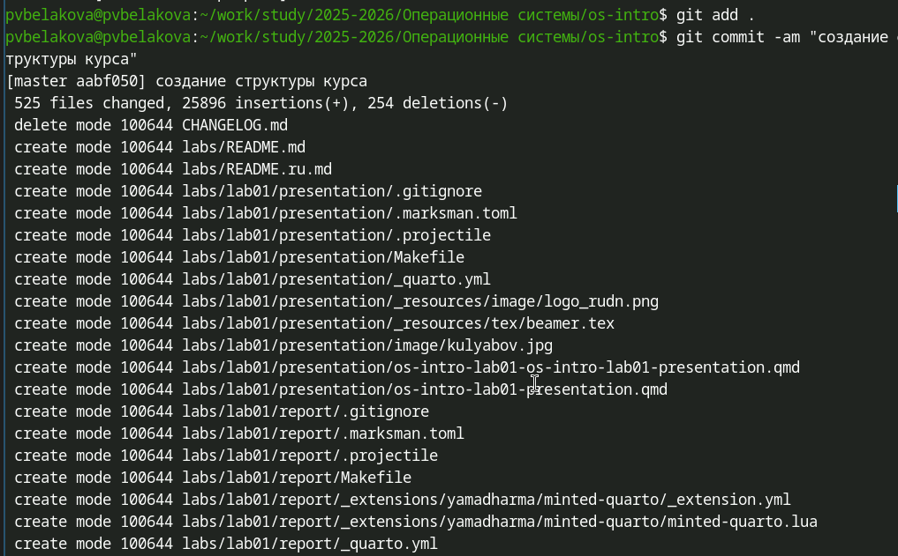{#fig-016 width=70%}
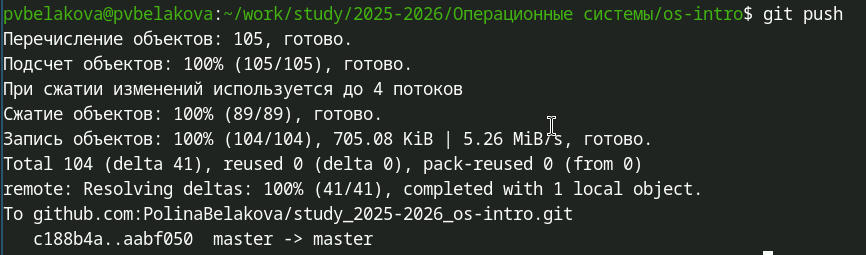{#fig-017 width=70%}

# Выводы

Была изучена идеология и применение средств контроля версий.Приобретены навыки работы с git.

# Контрольные вопросы

1. Что такое системы контроля версий (VCS) и для решения каких задач они предназначаются?
Система контроля версий (VCS) — это программное
обеспечение для отслеживания изменений в файлах и координации ра-
боты над ними. VCS хранит историю изменений, позволяет возвращаться
к предыдущим версиям и определять авторство каждой правки. Главные
задачи : обеспечение совместной работы нескольких человек над проек-
том, защита от потери данных и возможность экспериментировать без
риска сломать основной код.

2. Объясните понятия : хранилище, commit, история, рабочая копия.
Хранилище (repository) — это место, где VCS хранит все файлы проекта и всю
историю их изменений. Commit — операция сохранения текущего состо-
яния файлов в хранилище, «снимок» проекта в определённый момент
времени. История — цепочка последовательных commit’ов, позволяющая
проследить эволюцию проекта. Рабочая копия — текущая версия файлов
на вашем компьютере, с которой вы непосредственно работаете.

3. Чем отличаются централизованные и децентрализованные VCS?
 В цен-
трализованных VCS (например, SVN) существует одно главное храни
лище на сервере, а разработчики получают только рабочие копии; при
недоступности сервера работа с историей невозможна. В децентрализо
ванных VCS (например, Git) каждый разработчик имеет полную копию
хранилища с историей на своём компьютере, что позволяет работатьавтономно. Любая локальная копия в DVCS является полноценным ре-
зервным хранилищем проекта.

4. Опишите действия с VCS при единоличной работе.
 При единоличнойработе сначала инициализируется пустое хранилище в папке проекта(git init). Затем создаются и изменяются файлы, после чего они добавляются в индекс (git add) и фиксируются (git commit) с пояснительным
сообщением. В любой момент можно посмотреть историю изменений (gitlog) или вернуться к более ранней версии проекта.

5. Опишите порядок работы с общим хранилищем VCS.
Работа начинаетсяс клонирования удалённого репозитория (git clone). Перед началом работы и перед отправкой изменений необходимо загрузить актуальную версию от коллег (git pull). После внесения изменений они фиксируются
локально (git commit), а затем отправляются в общее хранилище (git push).
При возникновении конфликтов их нужно разрешить вручную и сделатьcommit слияния

6. Каковы основные задачи git?
Git обеспечивает полную историю изменений проекта с возможностью навигации по ней. Он поддерживает нелинейную разработку через мощную систему ветвления и гарантирует целостность данных с помощью контрольных сумм. Git позволяет каждому разработчику иметь полную копию репозитория и работать автономно, а также предоставляет гибкие инструменты для управления версиями (теги, ветки).

7. Назовите и дайте краткую характеристику командам git.
git init создаёт новый локальный репозиторий, а git clone копирует удалённый. git addдобавляет изменения в индекс, git commit фиксирует их в репозитории.git push отправляет изменения на удалённый сервер, а git pull загружает их оттуда. git branch и git checkout управляют ветками, git merge сливает ветки, а git status и git log показывают состояние и историю.

8. Приведите примеры использования с локальным и удалённым репозиториями.
Локально git init → создаём файлы → git add → git commit -m ’сообщение” → git log для просмотра истории. С удалённым : git clone →
git pull для обновления → работаем → git commit → git push для отправки изменений. Для новой задачи создаём ветку git checkout -b feature, а после
завершения отправляем её git push origin feature.

9. Что такое ветви (branches) и зачем они нужны?
Ветка — это перемещаемый указатель на один из commit’ов, позволяющий вести разработку изолированно от основной линии. Ветки нужны для параллельной разработки новых функций без риска сломать стабильный код. Они также используются для срочного исправления ошибок, проведения эксперментов и организации работы нескольких разработчиков над одним проектом.

10. Как и зачем игнорировать файлы при commit?
Для игнорирования файлов используется файл .gitignore, в котором перечисляются шаблоны имён файлов и папок, не подлежащих версионированию. Игнорируют временные файлы редакторов, скомпилированные бинарные файлы, конфиденциальные данные и папки с зависимостями. Это позволяет держать репозиторий чистым и лёгким, содержащим только исходный код и документацию.

# Список литературы{.unnumbered)
