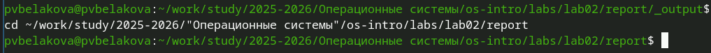
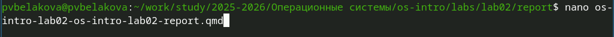
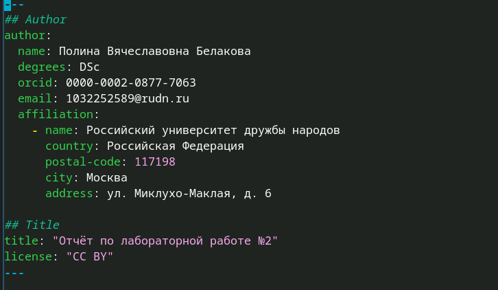
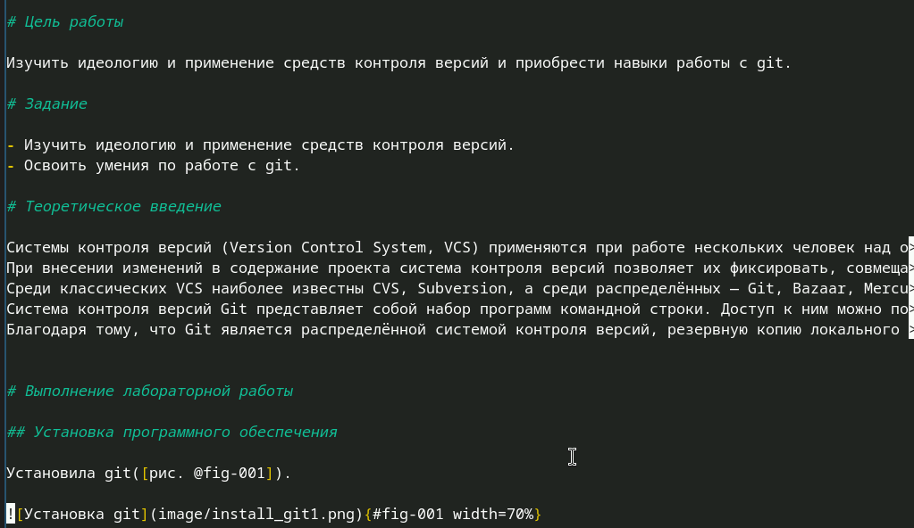
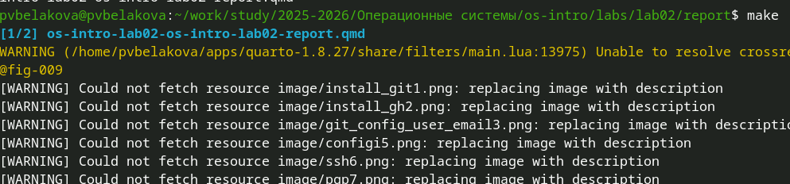

---
## Author
author:
  name: Полина Вячеславовна Белакова
  degrees: DSc
  orcid: 0000-0002-0877-7063
  email: 1032252589@rudn.ru
  affiliation:
    - name: Российский университет дружбы народов
      country: Российская Федерация
      postal-code: 117198
      city: Москва
      address: ул. Миклухо-Маклая, д. 6

## Title
title: "Отчёт по лабораторной работе №3"
license: "CC BY"
---

# Цель работы

Научиться оформлять отчёты с помощью легковесного языка разметки Markdown

# Задание

Сделать отчет по предыдущей лабораторной работе в формате Markdown. В качестве отчёта просьба предоставить отчёты в 3 форматах: pdf, docx и md (в архиве,
поскольку он должен содержать скриншоты, Makefile и т.д.)

# Теоретическое введение

Чтобы создать заголовок, используйте знак ( #), например:
1 #This is heading 1
2 ##This is heading 2
3 ###This is heading 3
4 ####This is heading 4

Чтобы задать для текста полужирное начертание, заключите его в двойные звездочки :
1 This text is **bold**.
Чтобы задать для текста курсивное начертание, заключите его в одинарные звездочки :
1 This text is *italic*.
Чтобы задать для текста полужирное и курсивное начертание, заключите его в тройные
звездочки :
1 This is text is both ***bold and italic***.

# Выполнение лабораторной работы

Перехожу в каталог ([рис. @fig-001]).

{#fig-001 width=70%}

Открываю текстовый редактор Nano ([рис. @fig-002]).

{#fig-002 width=70%}

Заполняю шапку отчета ([рис. @fig-003]).

{#fig-003 width=70%}

Прожалжаю заполнять отчет ([рис. @fig-004]).

{#fig-004 width=70%}

Сохраняю отчет комбинацией клавиш ctrl+o и ввожу команду make для создания производных файлов([рис. @fig-005]).

{#fig-005 width=70%}

# Выводы

Научилась оформлять отчёты с помощью легковесного языка разметки Markdown.

# Список литературы{.unnumbered}

::: {#refs}
:::
