---
## Author
author:
  name: Полина Вячеславовна Белакова
  degrees: DSc
  orcid: 0000-0002-0877-7063
  email: 1032252589@rudn.ru
  affiliation:
    - name: Российский университет дружбы народов
      country: Российская Федерация
      postal-code: 117198
      city: Москва
      address: ул. Миклухо-Маклая, д. 6

## Title
title: "Отчёт по лабораторной работе №5"
license: "CC BY"
---

# Цель работы

Установка и настройка менеджера паролей pass.
 Изучение системы управления конфигурациями chezmoi.

# Задание

Установить pass, создать структуру каталогов для паролей, настроить git-синхронизацию. Установить chezmoi, научиться добавлять, просматривать и применять изменения.

# Теоретическое введение

Менеджер паролей pass

Менеджер паролей pass — программа, сделанная в рамках идеологии Unix.
Также носит название стандартного менеджера паролей для Unix (The standard Unix password manager).

Основные свойства

Данные хранятся в файловой системе в виде каталогов и файлов.
Файлы шифруются с помощью GPG-ключа.

Структура базы паролей

Структура базы может быть произвольной, если Вы собираетесь использовать её напрямую, без промежуточного программного обеспечения. Тогда семантику структуры базы данных Вы держите в своей голове.
Если же необходимо использовать дополнительное программное обеспечение, необходимо семантику заложить в структуру базы паролей.

Утилиты командной строки

На данный момент существует 2 основных реализации :
pass — классическая реализация в виде shell-скриптов (https://www.passwordstore.org/);
gopass — реализация на go с дополнительными интегрированными функциями (https://www.gopass.pw/).

Конфигурация chezmoi

Рабочие файлы

    Состояние файлов конфигурации сохраняется в каталоге

    ~/.local/share/chezmoi

    Он является клоном вашего репозитория dotfiles.
    Файл конфигурации ~/.config/chezmoi/chezmoi.toml (можно использовать также JSON или YAML) специфичен для локальной машины.
    Файлы, содержимое которых одинаково на всех ваших машинах, дословно копируются из исходного каталога.
    Файлы, которые варьируются от машины к машине, выполняются как шаблоны, обычно с использованием данных из файла конфигурации локальной машины для настройки конечного содержимого, специфичного для локальной машины.

    При запуске

    chezmoi apply

вычисляется желаемое содержимое и разрешения для каждого файла, а затем вносит необходимые изменения, чтобы ваши файлы соответствовали этому состоянию.

    По умолчанию chezmoi изменяет файлы только в рабочей копии.

# Выполнение лабораторной работы

##Менеджер паролей pass

Установка pass  ([рис. @fig-001]).

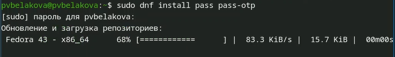{#fig-001 width=70%}

Просмотр ключей gpg и инициализация хранилища  ([рис. @fig-002]).

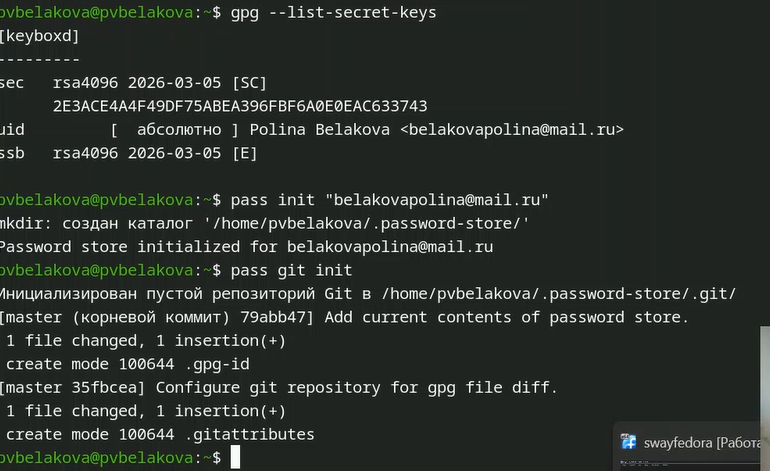{#fig-002 width=70%}

##Синхронизация с git
Создаю структуру git, создаю новый репозиторий и задаю адрес репозитория на хостинге
Инициализация хранилища  ([рис. @fig-003]).

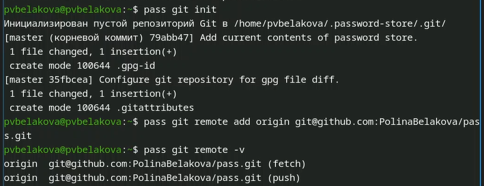{#fig-003 width=70%}

Настройка интерфейса с броузером ([рис. @fig-004]).

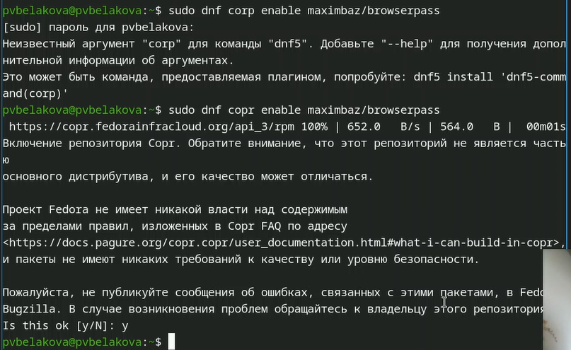{#fig-004 width=70%}

##Сохранение пароля

Добавляю новый пароль и отобража пароль для указанного имени файла([рис. @fig-005]).

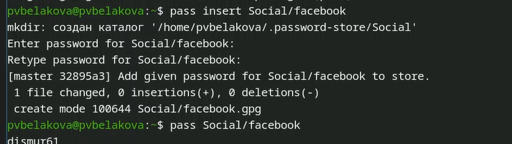{#fig-005 width=70%}

##Управление файлами конфигурации

Устанавливаю дополнительное программное обеспечение([рис. @fig-006]).

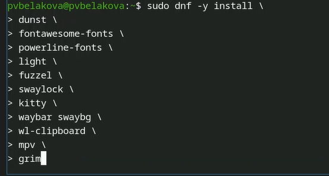{#fig-006 width=70%}

Устанавливаю шрифты ([рис. @fig-007]).

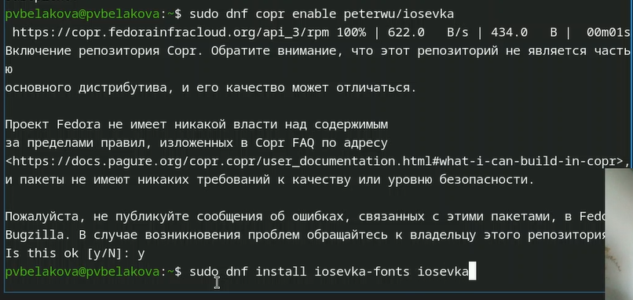{#fig-007 width=70%}

Устанавливаю бинарный файл с помощью wget([рис. @fig-008]).

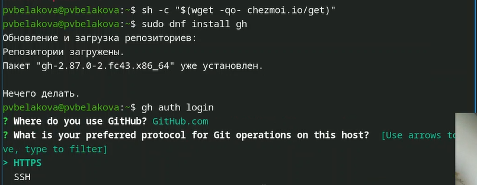{#fig-008 width=70%}

##Создание собственного репозитория с помощью утилит

Создаю свой репозиторий для конфигурационных файлов на основе шаблона, инициализирую chezmoi с репозиторием dotfiles, проверяю, какие изменения внесёт chezmoi в домашний каталог, вношу изменения([рис. @fig-009]).

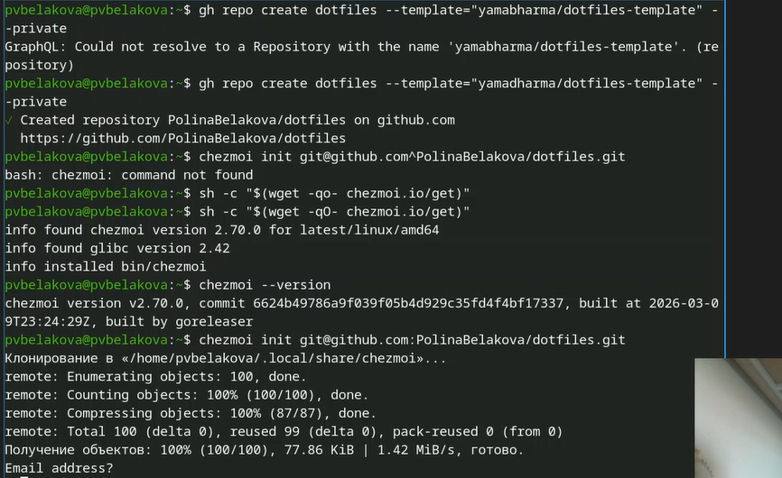{#fig-009 width=70%}

##Использование chezmoi на нескольких машинах

На второй машине инициализирую chezmoi с репозиторием dotfiles, настраиваю новую машину с помощью команды([рис. @fig-010]).

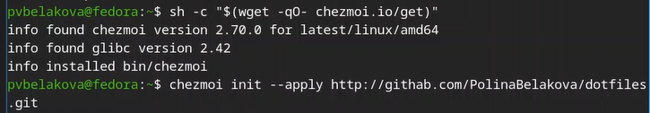{#fig-010 width=70%}

##Ежедневные операции c chezmoi

Извлекаю последние изменения из репозитория и применяю их([рис. @fig-011]).

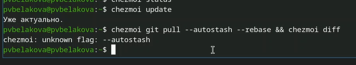{#fig-011 width=70%}

Чтобы включить автомотическое сохранение изменений, добавляю в файл конфигурации ~/.config/chezmoi/chezmoi.toml код ([рис. @fig-012]).

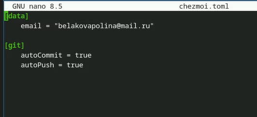{#fig-012 width=70%}

# Выводы

Был установлен и настроен менеджер паролей pass,изучена система управления конфигурациями chezmoi.

# Список литературы{.unnumbered}

::: {#refs}
:::
