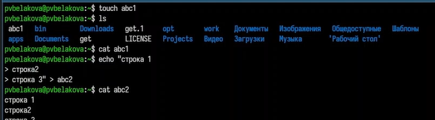
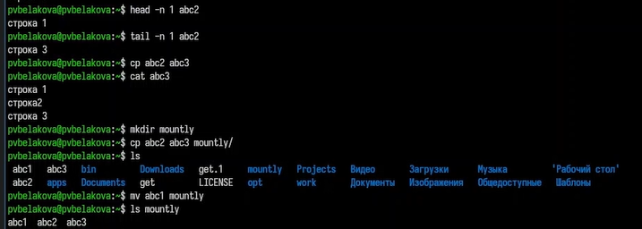
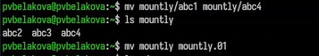
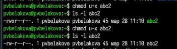
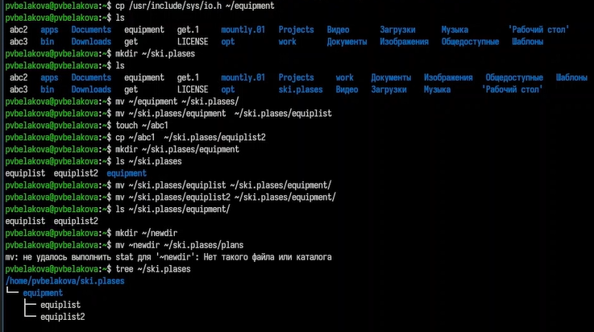
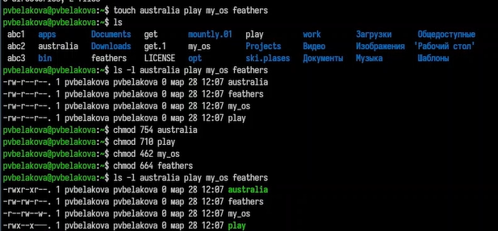
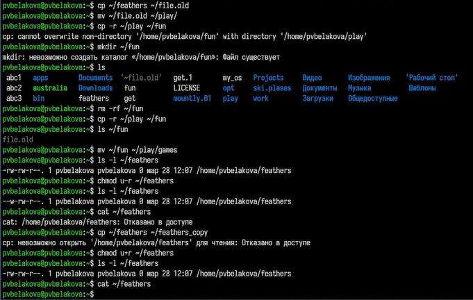
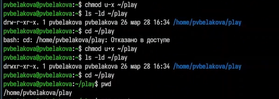
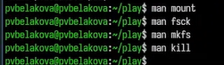

---
## Author
author:
  name: Полина Вячеславовна Белакова
  degrees: DSc
  orcid: 0000-0002-0877-7063
  email: 1032252589@rudn.ru
  affiliation:
    - name: Российский университет дружбы народов
      country: Российская Федерация
      postal-code: 117198
      city: Москва
      address: ул. Миклухо-Маклая, д. 6

## Title
title: "Отчёт по лабораторной работе 7"
license: "CC BY"
---

# Цель работы

Ознакомление с файловой системой Linux, её структурой, именами и содержанием
каталогов. Приобретение практических навыков по применению команд для работы
с файлами и каталогами, по управлению процессами (и работами), по проверке исполь-
зования диска и обслуживанию файловой системы.

# Задание

Ознакомиться с файловой системой Linux, её структурой, именами и содержанием
каталогов. Изучить команды для работы с файлами и каталогами, по управлению 
процессами (и работами), по проверке использования диска и обслуживанию файловой системы.

# Выполнение лабораторной работы

1. Выполните все примеры, приведённые в первой части описания лабораторной работы.

Команды для работы с файлами и каталогами
Для создания текстового файла использую команду touch. Записываю в файл данные с помощью echo.
Для просмотра файлов использую команду cat. ([рис. @fig-001]).

{#fig-001 width=70%}

С помощью команды head вывожу первую строку файла, командой tail вывожу последнюю строку файла ([рис. @fig-002]).

Копирование файлов и каталогов
Использую команду cp для копирования файлов и каталогов ([рис. @fig-002]).

{#fig-002 width=70%}

Перемещение и переименование файлов и каталогов
Команды mv и mvdir предназначены для перемещения и переименования файлов
и каталогов.([рис. @fig-003]).

{#fig-003 width=70%}

Изменение прав доступа
Изменяю права доступа к файлу или каталогу, воспользовавшись командой
chmod.([рис. @fig-004]).

{#fig-004 width=70%}

2. Выполните следующие действия, зафиксировав в отчёте по лабораторной работе
используемые при этом команды и результаты их выполнения:
2.1. Скопируйте файл /usr/include/sys/io.h в домашний каталог и назовите его
equipment. Если файла io.h нет, то используйте любой другой файл в каталоге
/usr/include/sys/ вместо него.
2.2. В домашнем каталоге создайте директорию ~/ski.plases.
2.3. Переместите файл equipment в каталог ~/ski.plases.
2.4. Переименуйте файл ~/ski.plases/equipment в ~/ski.plases/equiplist.
2.5. Создайте в домашнем каталоге файл abc1 и скопируйте его в каталог
~/ski.plases, назовите его equiplist2.
2.6. Создайте каталог с именем equipment в каталоге ~/ski.plases.
2.7. Переместите файлы ~/ski.plases/equiplist и equiplist2 в каталог
~/ski.plases/equipment.
2.8. Создайте и переместите каталог ~/newdir в каталог ~/ski.plases и назовите
его plans.
([рис. @fig-005]).

{#fig-005 width=70%}

3. Определите опции команды chmod, необходимые для того, чтобы присвоить перечисленным ниже файлам выделенные права доступа, считая, что в начале таких прав
нет:
3.1. drwxr--r-- ... australia
3.2. drwx--x--x ... play
3.3. -r-xr--r-- ... my_os
3.4. -rw-rw-r-- ... feathers
При необходимости создайте нужные файлы.([рис. @fig-006]).

{#fig-006 width=70%}

4. Проделайте приведённые ниже упражнения, записывая в отчёт по лабораторной работе используемые при этом команды:
4.1. Просмотрите содержимое файла /etc/password.
4.2. Скопируйте файл ~/feathers в файл ~/file.old.
4.3. Переместите файл ~/file.old в каталог ~/play.
4.4. Скопируйте каталог ~/play в каталог ~/fun.
4.5. Переместите каталог ~/fun в каталог ~/play и назовите его games.
4.6. Лишите владельца файла ~/feathers права на чтение.
4.7. Что произойдёт, если вы попытаетесь просмотреть файл ~/feathers командой
cat? Просмотреть содержимое файла не получится, т.к. отсутствуют права доступа.
4.8. Что произойдёт, если вы попытаетесь скопировать файл ~/feathers?
4.9. Дайте владельцу файла ~/feathers право на чтение.([рис. @fig-007]).

{#fig-007 width=70%}

4.10. Лишите владельца каталога ~/play права на выполнение.
4.11. Перейдите в каталог ~/play. Что произошло?
4.12. Дайте владельцу каталога ~/play право на выполнение.([рис. @fig-008]).

{#fig-008 width=70%}

5. Прочитайте man по командам mount, fsck, mkfs, kill и кратко их охарактеризуйте, приведя примеры([рис. @fig-009]).

{#fig-009 width=70%}

# Выводы

# Список литературы{.unnumbered}

::: {#refs}
:::
