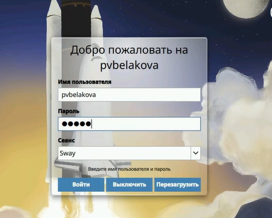
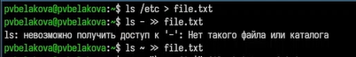
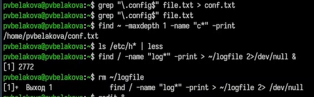
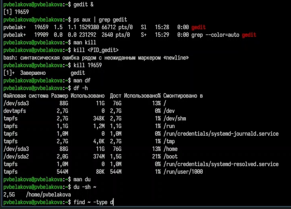

---
## Author
author:
  name: Полина Вячеславовна Белакова
  degrees: DSc
  orcid: 0000-0002-0877-7063
  email: 1032252589@rudn.ru
  affiliation:
    - name: Российский университет дружбы народов
      country: Российская Федерация
      postal-code: 117198
      city: Москва
      address: ул. Миклухо-Маклая, д. 6

## Title
title: "Отчёт по лабораторной работе №8"
license: "CC BY"
---

# Цель работы

Ознакомление с инструментами поиска файлов и фильтрации текстовых данных.
Приобретение практических навыков: по управлению процессами (и заданиями), по
проверке использования диска и обслуживанию файловых систем.

# Задание

Ознакомиться с инструментами поиска файлов и фильтрации текстовых данных.
Приобрести практических навыков: по управлению процессами (и заданиями), по
проверке использования диска и обслуживанию файловых систем.

# Теоретическое введение

В системе по умолчанию открыто три специальных потока:
– stdin — стандартный поток ввода (по умолчанию: клавиатура), файловый дескриптор
0;
– stdout — стандартный поток вывода (по умолчанию: консоль), файловый дескриптор
1;
– stderr — стандартный поток вывод сообщений об ошибках (по умолчанию: консоль),
файловый дескриптор 2.
Большинство используемых в консоли команд и программ записывают результаты
своей работы в стандартный поток вывода stdout. Например, команда ls выводит в стан-
дартный поток вывода (консоль) список файлов в текущей директории. Потоки вывода
и ввода можно перенаправлять на другие файлы или устройства. Проще всего это делается
с помощью символов >, >>, <, <<.

Конвейер (pipe) служит для объединения простых команд или утилит в цепочки, в ко-
торых результат работы предыдущей команды передаётся последующей. Синтаксис
следующий:
1 команда 1 | команда 2
2 # означает, что вывод команды 1 передастся на ввод команде 2
Конвейеры можно группировать в цепочки и выводить с помощью перенаправления
в файл, например:
1 ls -la |sort > sortilg_list
вывод команды ls -la передаётся команде сортировки sort\verb, которая пишет ре-
зультат в файл sorting_list\verb.
Чаще всего скрипты на Bash используются в качестве автоматизации каких-то рутин-
ных операций в консоли, отсюда иногда возникает необходимость в обработке stdout
одной команды и передача на stdin другой команде, при этом результат выполнения
команды должен обработан.

# Выполнение лабораторной работы

1. Осуществите вход в систему, используя соответствующее имя пользователя.([рис. @fig-001]).

{#fig-001 width=70%}

2. Запишите в файл file.txt названия файлов, содержащихся в каталоге /etc. Допи-
шите в этот же файл названия файлов, содержащихся в вашем домашнем каталоге.([рис. @fig-002]).

{#fig-002 width=70%}

3. Выведите имена всех файлов из file.txt, имеющих расширение .conf, после чего
запишите их в новый текстовой файл conf.txt ([рис. @fig-003]).
4. Определите, какие файлы в вашем домашнем каталоге имеют имена, начинавшиеся
с символа c? Предложите несколько вариантов, как это сделать.([рис. @fig-003]).
5. Выведите на экран (по странично) имена файлов из каталога /etc, начинающиеся
с символа h.([рис. @fig-003]).
6. Запустите в фоновом режиме процесс, который будет записывать в файл ~/logfile
файлы, имена которых начинаются с log.([рис. @fig-003]).
7. Удалите файл ~/logfile.([рис. @fig-003]).

{#fig-003 width=70%}

8. Запустите из консоли в фоновом режиме редактор gedit.([рис. @fig-004]).
9. Определите идентификатор процесса gedit, используя команду ps, конвейер и фильтр
grep. Как ещё можно определить идентификатор процесса?([рис. @fig-004]).
10. Прочтите справку (man) команды kill, после чего используйте её для завершения
процесса gedit.([рис. @fig-004]).
11. Выполните команды df и du, предварительно получив более подробную информацию
об этих командах, с помощью команды man.([рис. @fig-004]).
12. Воспользовавшись справкой команды find, выведите имена всех директорий, имею-
щихся в вашем домашнем каталоге.([рис. @fig-004]).

{#fig-004 width=70%}

Контрольные вопросы

1. Какие потоки ввода/вывода вы знаете?
stdin (0) — ввод, stdout (1) — вывод, stderr (2) — ошибки.

2. Разница между > и >>?
> — перезаписывает файл, >> — добавляет в конец.

3. Что такое конвейер (|)?
Передача вывода одной команды на ввод другой.

4. Что такое процесс? Чем отличается от программы?
Процесс — выполняющийся экземпляр программы. Программа — пассивный файл.

5. Что такое PID и GID?
PID — идентификатор процесса; GID — идентификатор группы процесса.

6. Что такое задачи и команда для управления ими?
Задачи — фоновые процессы в оболочке. Управление: jobs, fg, bg, kill.

7. Утилиты top и htop?
top — мониторинг процессов в реальном времени; htop — улучшенная версия.

8. Команда поиска файлов (find)? Примеры.
find / -name "*.txt" — найти все .txt.

9. Можно ли найти файл по содержанию? Как?
Да, grep -r "текст" ~/

10. Объем свободной памяти на диске?
df -h

11. Объем домашнего каталога?
du -sh ~

12. Как удалить зависший процесс?
kill -9 <PID>

# Выводы

Были изучены  инструменты поиска файлов и фильтрации текстовых данных.
Приобретены практические навыки: по управлению процессами (и заданиями), по
проверке использования диска и обслуживанию файловых систем.

# Список литературы{.unnumbered}

::: {#refs}
:::
