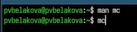
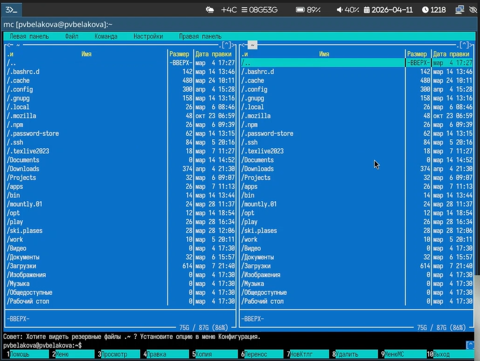
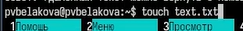
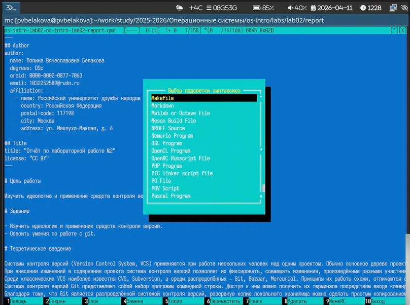
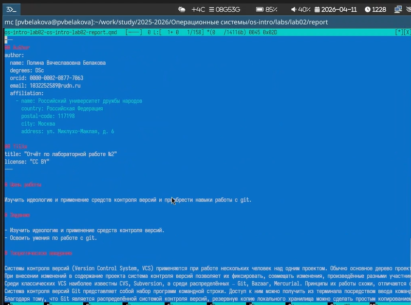

---
## Author
author:
  name: Полина Вячеславовна Белакова
  degrees: DSc
  orcid: 0000-0002-0877-7063
  email: 1032252589@rudn.ru
  affiliation:
    - name: Российский университет дружбы народов
      country: Российская Федерация
      postal-code: 117198
      city: Москва
      address: ул. Миклухо-Маклая, д. 6

## Title
title: "Отчёт по лабораторной работе №9"
license: "CC BY"
---

# Цель работы

Освоение основных возможностей командной оболочки Midnight Commander. Приоб
ретение навыков практической работы по просмотру каталогов и файлов; манипуляций
с ними.

# Задание

Изучить основные возможности командной оболочки Midnight Commander. Получить
 навыки практической работы по просмотру каталогов и файлов; манипуляций
с ними.

# Теоретическое введение

Командная оболочка — интерфейс взаимодействия пользователя с операционной систе-
мой и программным обеспечением посредством команд.
Midnight Commander (или mc) — псевдографическая командная оболочка для UNIX/Linux
систем. Для запуска mc необходимо в командной строке набрать mc и нажать Enter .
Рабочее пространство mc имеет две панели, отображающие по умолчанию списки
файлов двух каталогов.

Панель в mc отображает список файлов текущего каталога. Абсолютный путь к этому
каталогу отображается в заголовке панели. У активной панели заголовок и одна из её
строк подсвечиваются. Управление панелями осуществляется с помощью определённых
комбинаций клавиш или пунктов меню mc.

Панели можно поменять местами. Для этого и используется комбинация клавиш Ctrl-u
или команда меню mc Переставить панели . Также можно временно убрать отображение
панелей (отключить их) с помощью комбинации клавиш Ctrl-o или команды меню mc
Отключить панели . Это может быть полезно, например, если необходимо увидеть вывод
какой-то информации на экран после выполнения какой-либо команды shell.

С помощью последовательного применения комбинации клавиш Ctrl-x d есть
возможность сравнения каталогов, отображённых на двух панелях. Панели могут допол-
нительно быть переведены в один из двух режимов: Информация или Дерево . В режиме
Информация на панель выводятся сведения о файле и текущей файловой системе,
расположенных на активной панели. В режиме Дерево (рис. 7.3) на одной из панелей
выводится структура дерева каталогов.
Управлять режимами отображения панелей можно через пункты меню mc Правая панель
и Левая панель.

# Выполнение лабораторной работы

1. Изучаю информацию о mc, вызвав в командной строке man mc. ([рис. @fig-001])
2. Запускаю из командной строки mc([рис. @fig-001]), изучаю его структуру и меню([рис. @fig-002]).

{#fig-001 width=70%}

{#fig-002 width=70%}

3. Выполняю несколько операций в mc, используя управляющие клавиши.
4. Создаю текстовой файл text.txt.([рис. @fig-003]).

{#fig-003 width=70%}

5. Открываю этот файл с помощью f4.
6. Вставляю в открытый файл небольшой фрагмент текста.
7.1. Удаляю строку текста ctrl+y.
7.2. Выделяю фрагмент текста shift+-> и копирую его на новую строку f6.
7.3. Сохраняю файл f2.
7.4. Отменяю последнее действие ctrl+u.
7.5. Перехожу в конец файла ctrl+end.
7.6. Перехожу в начало файла ctrl+home.
7.7. Сохраняю f2 и закрываю файл f10.
8. Откройте файл с исходным текстом Markdown.
9. Используя меню редактора, включаю подсветку синтаксиса. ([рис. @fig-004]).[рис. @fig-005]).

{#fig-004 width=70%}

{#fig-005 width=70%}

Контрольные вопросы
1. Режимы работы mc:  Две панели (стандартный),  Информация (свойства файла/ФС),  Дерево (дерево каталогов),  Отключённые панели (только shell).

2. Операции с файлами через shell и mc:  Shell: cp, mv, rm, mkdir.  mc: F5 (копирование), F6 (перемещение), F8 (удаление), F7 (создать каталог).

3. Структура меню Левой/Правой панели:  Список, быстрый просмотр, дерево, информация, формат вывода, сортировка, фильтр.

4. Структура меню Файл:  Просмотр (F3), правка (F4), копирование (F5), перемещение (F6), создание каталога (F7), удаление (F8),
 права доступа, ссылки, выход (F10).

5. Структура меню Команда:  Дерево каталогов, поиск файлов, перестановка панелей, сравнение каталогов, история команд,
 быстрые каталоги, восстановление файлов, правка файлов меню/расширений.

6. Структура меню Настройки:  Конфигурация панелей, внешний вид, набор символов, подтверждения, распознавание клавиш, виртуальная ФС.

7. Встроенные команды mc:  cd, cp, mv, mkdir, rm, pwd, find – через командную строку внутри mc.

8. Команды встроенного редактора mc:  Сохранить (F2), выйти (F10), удалить строку (Ctrl+y),
 копировать/вставить (F5/F6), поиск (F7), отмена (Ctrl+u), переходы (Ctrl+Home, Ctrl+End).

9. Средства для создания пользовательского меню:  Файл ~/.mc/menu – редактируется через меню Команда → Редактировать файл меню.

10. Средства для действий над текущим файлом:  Команды меню Файл, горячие клавиши (F3–F8), а также пользовательское меню (F2).

# Выводы

В ходе выполнения лабораторной работы были освоены основные возможности командной оболочки Midnight Commander. Приоб
ретены навыки практической работы по просмотру каталогов и файлов; манипуляций
с ними.

# Список литературы{.unnumbered}

::: {#refs}
:::
