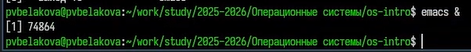
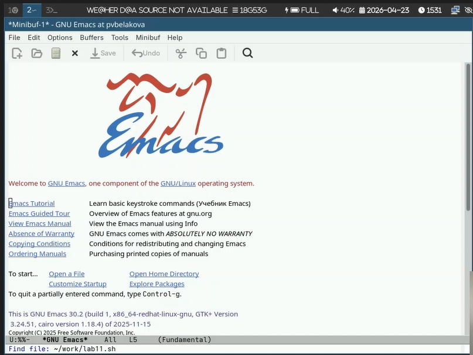
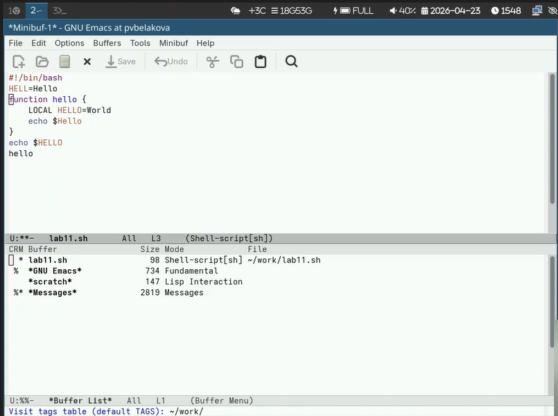
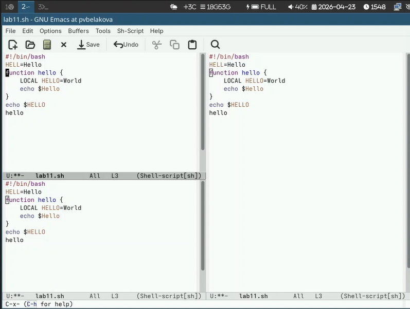

---
## Author
author:
  name: Полина Вячеславовна Белакова
  degrees: DSc
  orcid: 0000-0002-0877-7063
  email: 1032252589@rudn.ru
  affiliation:
    - name: Российский университет дружбы народов
      country: Российская Федерация
      postal-code: 117198
      city: Москва
      address: ул. Миклухо-Маклая, д. 6

## Title
title: "Отчет лабораторной работе 11"
license: "CC BY"
---

# Цель работы

- Познакомиться с операционной системой Linux.
- Получить практические навыки работы с редактором Emacs.

# Задание

- Знакомство с операционной системой Linux.
- Получение практических навыков работы с редактором Emacs.

# Теоретическое введение

Определение 1. Буфер — объект, представляющий какой-либо текст.

Буфер может содержать что угодно, например, результаты компиляции программы
или встроенные подсказки. Практически всё взаимодействие с пользователем, в том
числе интерактивное, происходит посредством буферов.

Определение 2. Фрейм соответствует окну в обычном понимании этого слова. Каждый
фрейм содержит область вывода и одно или несколько окон Emacs.

Определение 3. Окно — прямоугольная область фрейма, отображающая один из буфе-
ров.
Каждое окно имеет свою строку состояния, в которой выводится следующая информа-
ция: название буфера, его основной режим, изменялся ли текст буфера и как далеко вниз
по буферу расположен курсор. Каждый буфер находится только в одном из возможных
основных режимов. Существующие основные режимы включают режим Fundamental
(наименее специализированный), режим Text, режим Lisp, режим С, режим Texinfo
и другие. Под второстепенными режимами понимается список режимов, которые вклю-
чены в данный момент в буфере выбранного окна.

Определение 4. Область вывода — одна или несколько строк внизу фрейма, в которой
Emacs выводит различные сообщения, а также запрашивает подтверждения и дополни-
тельную информацию от пользователя.

Определение 5. Минибуфер используется для ввода дополнительной информации и все-
гда отображается в области вывода.

Определение 6. Точка вставки — место вставки (удаления) данных в буфере.

# Выполнение лабораторной работы

1. Открываю emacs.([рис. @fig-001]).

{#fig-001 width=70%}

2. Создаю файл lab11.sh с помощью комбинации Ctrl-x Ctrl-f (C-x C-f).([рис. @fig-002]).

{#fig-002 width=70%}

3. Набераю текст ([рис. @fig-003]).

{#fig-003 width=70%}

4. Сохраняю файл с помощью комбинации Ctrl-x Ctrl-s (C-x C-s).
5. Проделываю с текстом стандартные процедуры редактирования, с помощью комбинацией клавиш.
5.1. Вырезаю одной командой целую строку (С-k).
5.2. Вставляю эту строку (C-y).
5.3. Выделяю область текста (C-space).
5.4. Копировать область в буфер обмена (M-w).
5.5. Вставляю область в конец файла.
6. Использую команды по перемещению курсора.
6.1. Переместите курсор в начало строки (C-a).
6.2. Переместите курсор в конец строки (C-e).
6.3. Переместите курсор в начало буфера (M-<).
6.4. Переместите курсор в конец буфера (M->).
7. Управление буферами.([рис. @fig-004]).

{#fig-004 width=70%}

7.1. Вывести список активных буферов на экран (C-x C-b).
7.2. Переместитесь во вновь открытое окно (C-x) o со списком открытых буферов
и переключитесь на другой буфер.
7.3. Закройте это окно (C-x 0).
7.4. Теперь вновь переключайтесь между буферами, но уже без вывода их списка на
экран (C-x b).
8. Управление окнами ([рис. @fig-005]).

{#fig-005 width=70%}
9. Режим поиска
9.1. Переключаюсь в режим поиска (C-s) и найхожу несколько слов, присутствующихв тексте.
9.2. Переключаюсь между результатами поиска, нажимая C-s.
9.3. Выхлжу из режима поиска, нажав C-g.

# Контрольные вопросы

1. Кратко охарактеризуйте редактор Emacs.
Emacs — мощный расширяемый текстовый редактор с поддержкой множества режимов, написанный на Elisp.

2. Какие особенности могут сделать Emacs сложным для новичков?
Множество комбинаций клавиш, непривычная терминология, высокая настраиваемость.

3. Что такое буфер и окно в Emacs?
Буфер — область памяти с текстом. Окно — область экрана, отображающая буфер.

4. Можно ли открыть больше 10 буферов в одном окне?
Да, количество буферов не ограничено.

5. Какие буферы создаются по умолчанию при запуске Emacs?
*scratch*, *Messages*, *GNU Emacs*.

6. Как ввести комбинации C-c | и C-c C-|?
C-c | = Ctrl + c, затем Shift + \
C-c C-| = Ctrl + c, затем Ctrl + Shift + \

7. Как разделить текущее окно на две части?
C-x 2 (горизонтально), C-x 3 (вертикально).

8. Где хранятся настройки Emacs?
В файле ~/.emacs или ~/.emacs.d/init.el.

9. Можно ли переназначить клавиши?
Да, через global-set-key.

10. Какой редактор удобнее — vi или Emacs?
Ответ субъективен. Emacs удобнее для программирования и интеграции, vi — для быстрого редактирования в терминале.

# Выводы

В ходе выполнения лабораторной работы познакомилась с операционной системой Linux, получила практические навыки работы с редактором Emacs.
