---
## Author
author:
  name: Полина Вячеславовна Белакова
  degrees: DSc
  orcid: 0000-0002-0877-7063
  email: 1032252589@rudn.ru
  affiliation:
    - name: Российский университет дружбы народов
      country: Российская Федерация
      postal-code: 117198
      city: Москва
      address: ул. Миклухо-Маклая, д. 6
## Title
title: "Внешний курс 2 этап"
license: CC BY
date: today
date-format: "YYYY-MM-DD" # Example: 2025-09-06
---

# Информация

## Докладчик

:::::::::::::: {.columns align=center}
::: {.column width="70%"}

  * Белакова Полина Вячеславовна
  * студентка группы НКАбд-01-25
  * Российский университет дружбы народов им. П. Лумумбы
  * [1032252589@rudn.ru](mailto:1032252589@rudn.ru)

:::
::: {.column width="30%"}

:::
::::::::::::::

# Вводная часть

## Цель работы

Пройти курс "Введение в Linux"

## Задание

Просмотреть видео и на их основе выполнить задания в курсе.

# Выполнение лабораторной работы

Задание 1([рис. @fig-001]).

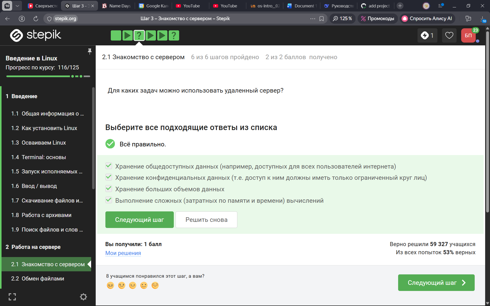{#fig-001 width=70%}

Удаленный сервер подходит для хранения данных любого типа (от общедоступных до конфиденциальных), для обработки больших объемов
 информации и выполнения тяжелых вычислений, так как у него больше ресурсов, чем у локального ПК.

---

Задание 2([рис. @fig-002]).

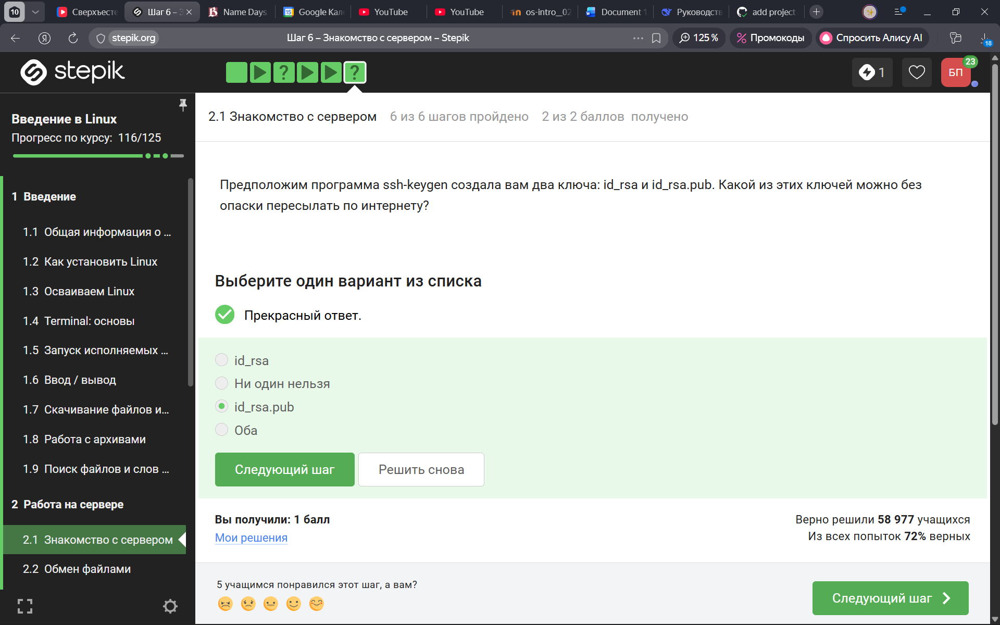{#fig-002 width=70%}

id_rsa.pub — это публичный ключ. Его можно передавать кому угодно, он используется только для шифрования. Приватный ключ id_rsa ни в
 коем случае нельзя никому отправлять.

---

Задание 3 ([рис. @fig-003]).

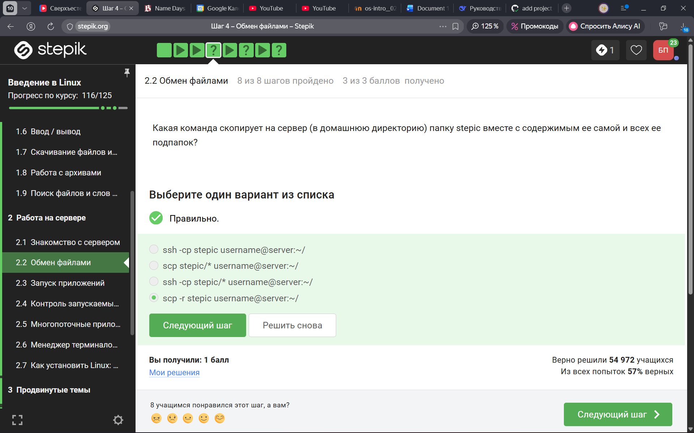{#fig-003 width=70%}

scp -r stepic username@server:~/. Флаг -r (recursive) обязателен для копирования папки со всем содержимым. scp — это безопасное
 копирование по SSH.

---

адание 4 ([рис. @fig-004]).

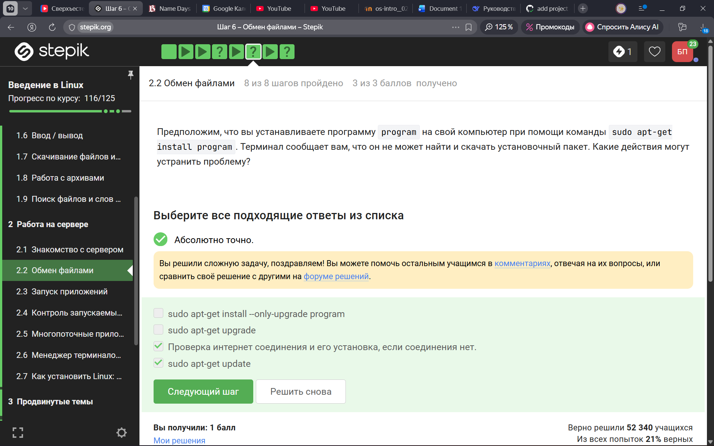{#fig-004 width=70%}

Нужно проверить интернет-соединение и выполнить sudo apt-get update (обновить индексы пакетов). Иногда пакет не устанавливается, если
 репозитории устарели.

---

Задание 5 ([рис. @fig-005]).

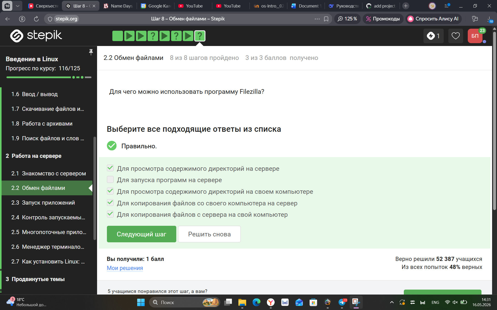{#fig-005 width=70%}

Filezilla — это FTP/SFTP-клиент, который позволяет просматривать файлы как на локальном ПК, так и на сервере, а также копировать их
 в обе стороны. Для запуска программ она не используется.

---

Задание 6 ([рис. @fig-006]).

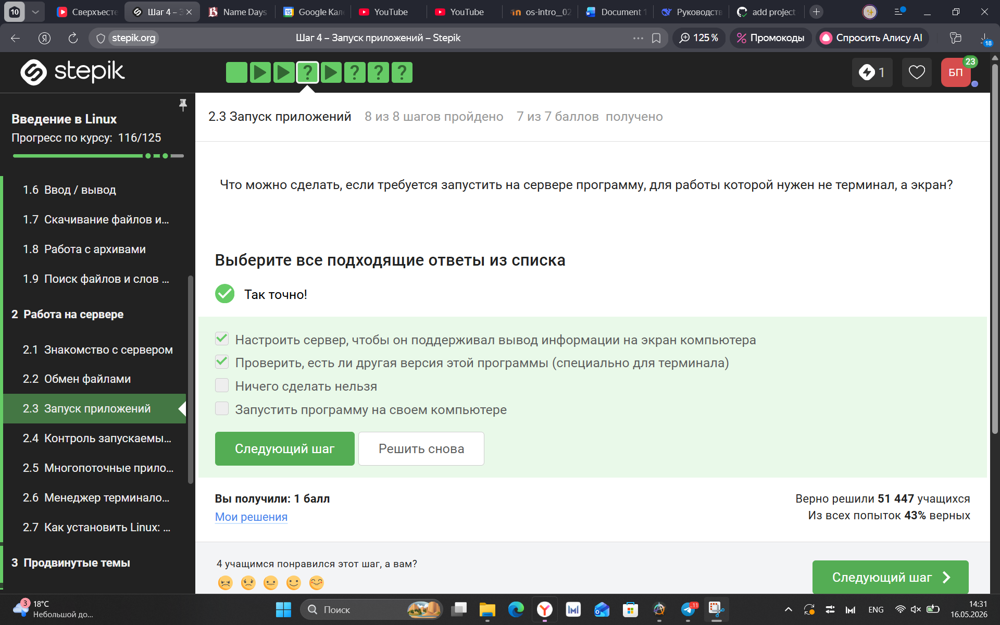{#fig-006 width=70%}

Можно настроить сервер для вывода на экран (что сложно) или найти версию программы, адаптированную для работы через терминал
 (например, текстовую версию вместо графической).

---

Задание 7([рис. @fig-007]).

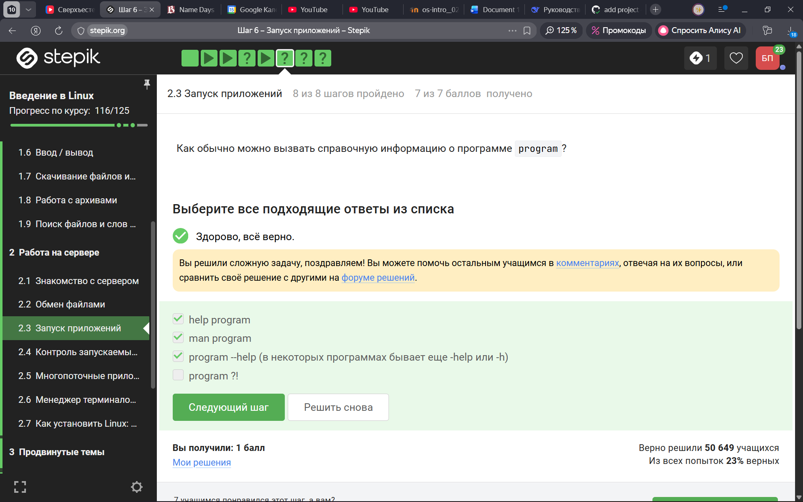{#fig-007 width=70%}

Стандартные способы: man program, program --help, help program. Команда program ?! в Linux не используется для получения справки.

---

Задание 8 ([рис. @fig-008]).

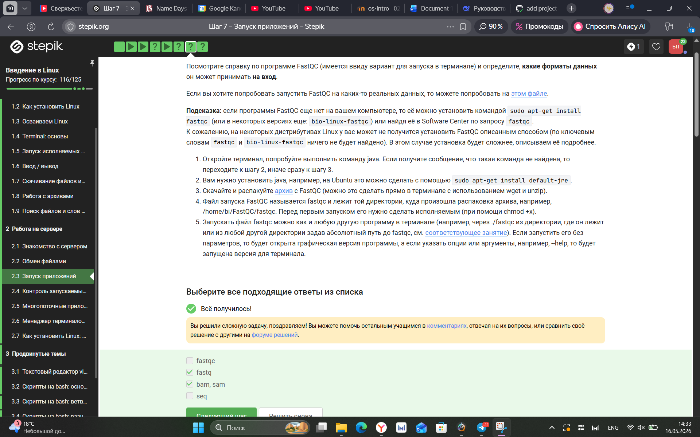{#fig-008 width=70%}

Задание обычно предполагает загрузку правильного скриншота/текста, где видно, что FastQC запустился и отработал без ошибок. Вывод в
 консоли подтверждает корректность действий.

---

Задание 9 ([рис. @fig-009]).

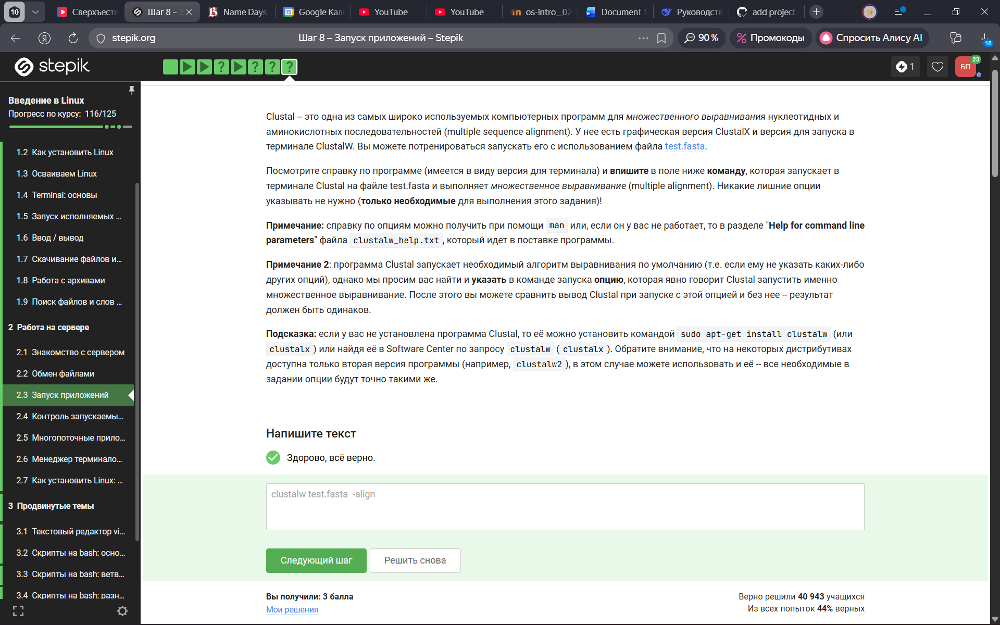{#fig-009 width=70%}

В  данном случае для запуска выравнивания через ClustalW в терминале используется команда clustalw test.fasta -align, где -align
 указывает на необходимость выполнения выравнивания.

---

Задание 10([рис. @fig-010]).

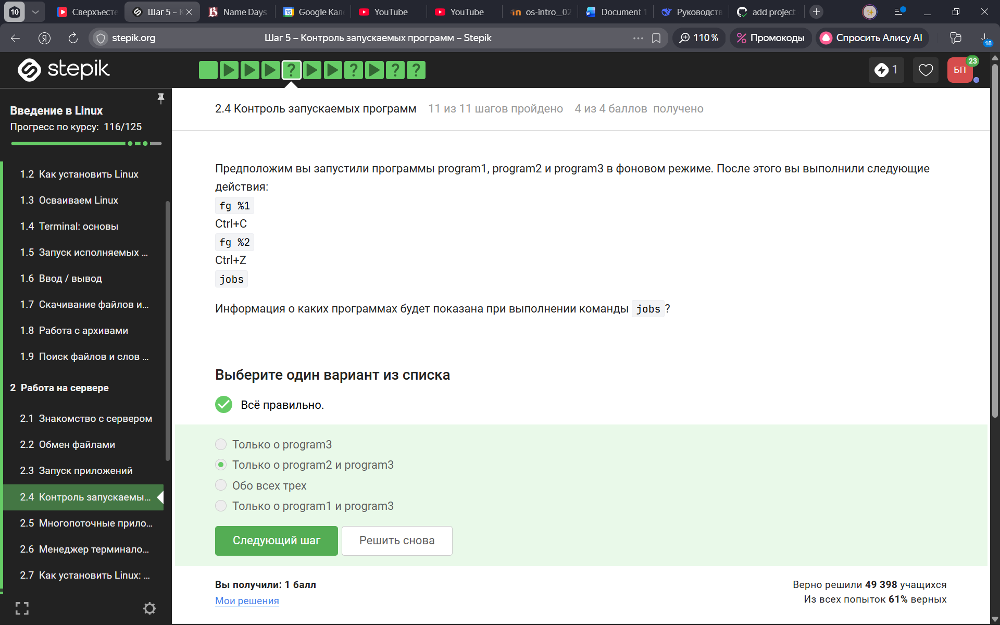{#fig-010 width=70%}

jobs показывает активные фоновые процессы. После действий (fg %1 — вернуть процесс на передний план, Ctrl+C — убить, fg %2 — вернуть
 второй) в фоне остаются только те процессы, которые не были завершены принудительно. В данном примере это второй и третий.

---

Задание 11([рис. @fig-011]).

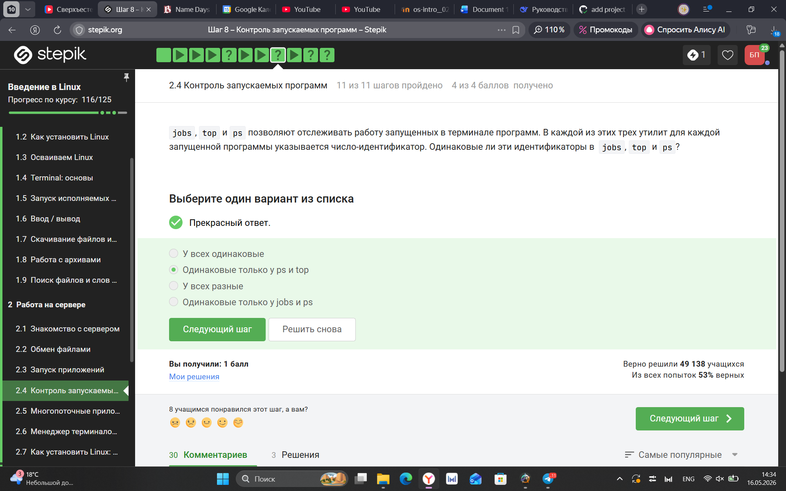{#fig-011 width=70%}

top показывает PID (идентификатор процесса), присвоенный системой. ps тоже показывает PID. jobs показывает номера заданий оболочки.
 PID у процесса в top и ps одинаковы.

---

Задание 12([рис. @fig-012]).

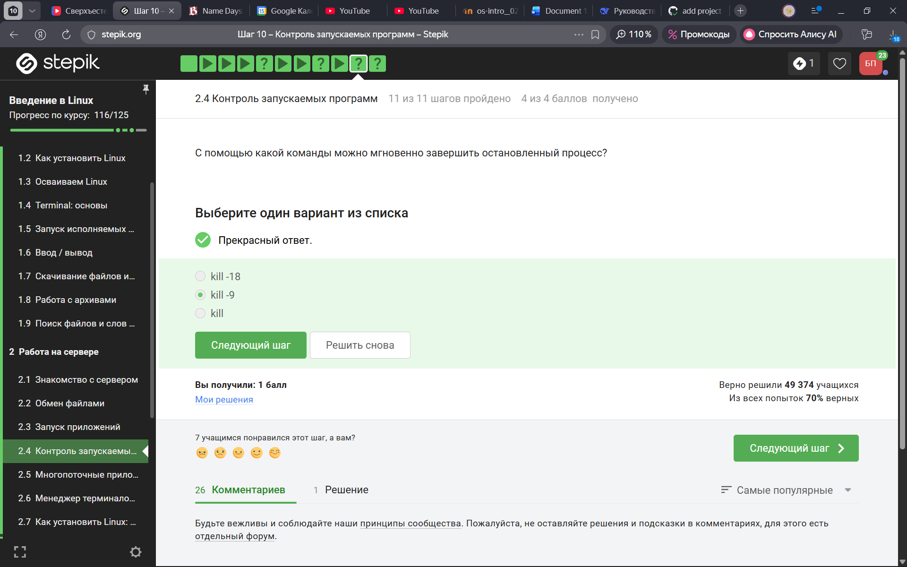{#fig-012 width=70%}

kill -9. Если kill без опций может не сработать (если процесс завис), то kill -9 отправляет сигнал SIGKILL, который невозможно
 проигнорировать, и процесс завершается мгновенно.

---

Задание 13 ([рис. @fig-013]).

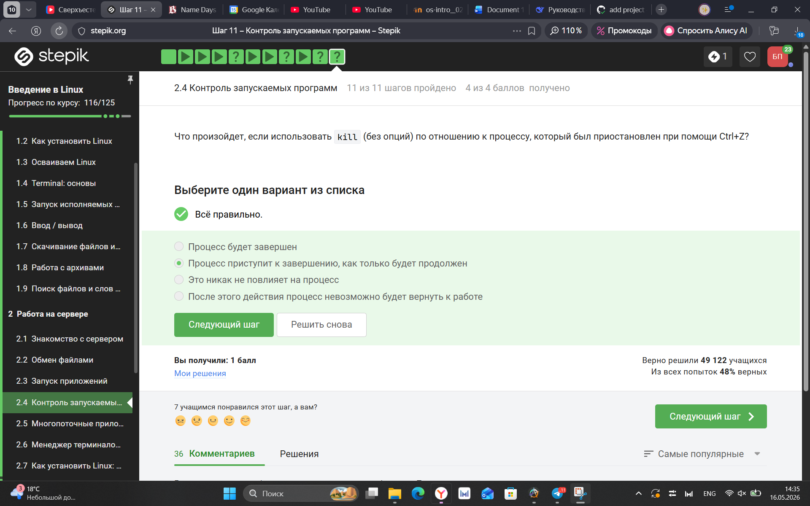{#fig-013 width=70%}

Если процесс приостановлен (Ctrl+Z), то kill (без -9) только пометит его на завершение, но фактически процесс будет завершен только
 тогда, когда он будет возобновлен и ему будет передан этот сигнал (процесс не завершится, пока его не продолжить).

---

Задание 14([рис. @fig-014]).

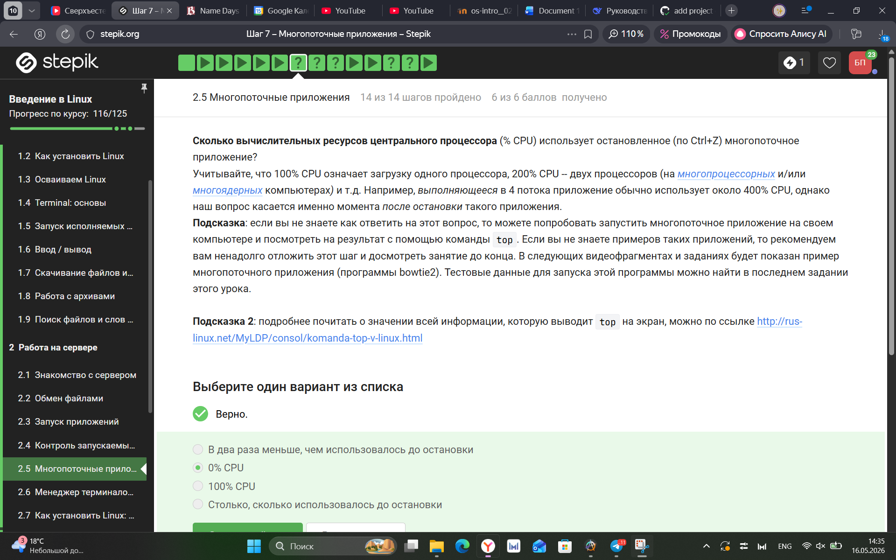{#fig-014 width=70%}

Если приложение приостановлено (находится в состоянии «Stopped»), оно не потребляет процессорное время. Поэтому 0% CPU.

---

Задание 15([рис. @fig-015]).

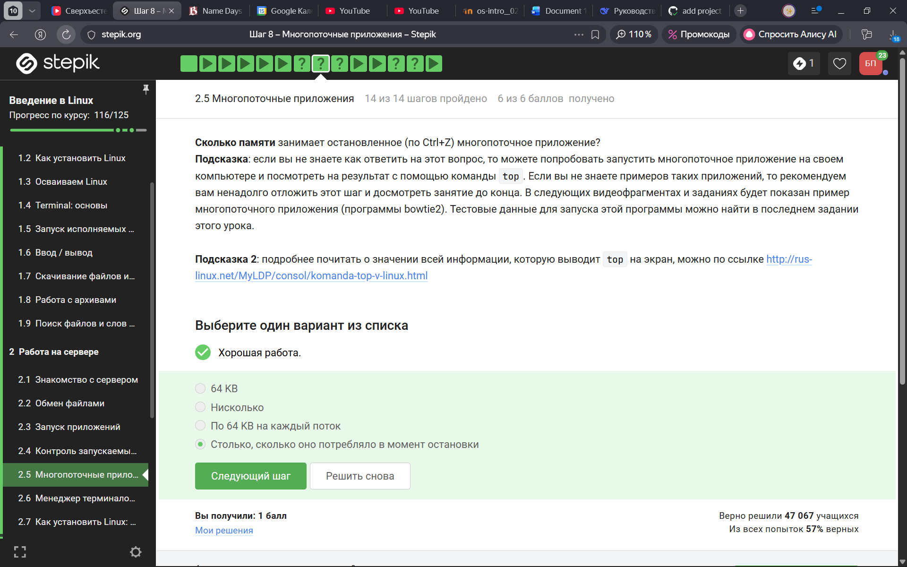{#fig-015 width=70%}

Приостановка процесса (Ctrl+Z) не освобождает оперативную память (RAM). Процесс сохраняется в памяти и занимает столько же, сколько
 потреблял до остановки.

---

Задание 16([рис. @fig-016]).

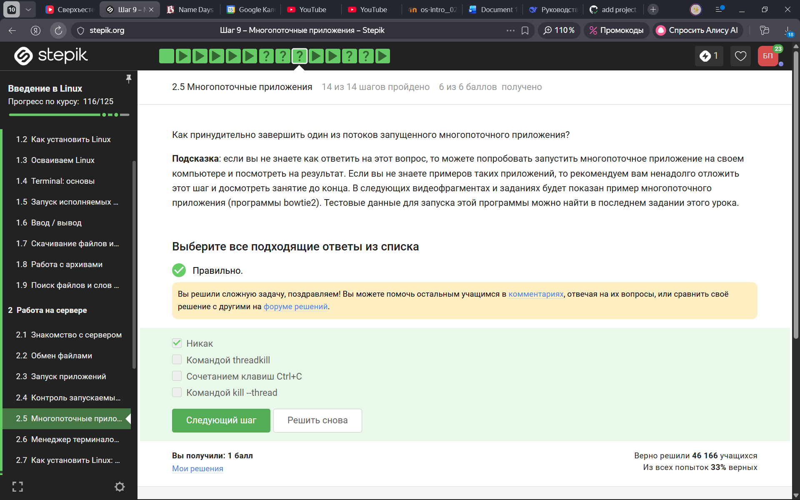{#fig-016 width=70%}

В стандартном Linux управление отдельными потоками (threads) из оболочки не производится командой kill для одного потока. Команды kill
 работают с PID процесса в целом (убивают все потоки). Отделить и убить один поток сложно, и на данном этапе обучения правильным
 ответом считается «Никак» (подразумевая «невозможно штатными командами»).

---

Задание 17([рис. @fig-017]).

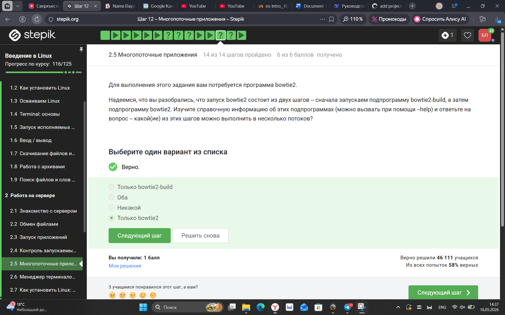{#fig-017 width=70%}

Сам алгоритм выравнивания (bowtie2) оптимизирован для многопоточности. Утилита bowtie2-build (сборка индекса) обычно работает в один поток.

---

Задание 18([рис. @fig-018]).

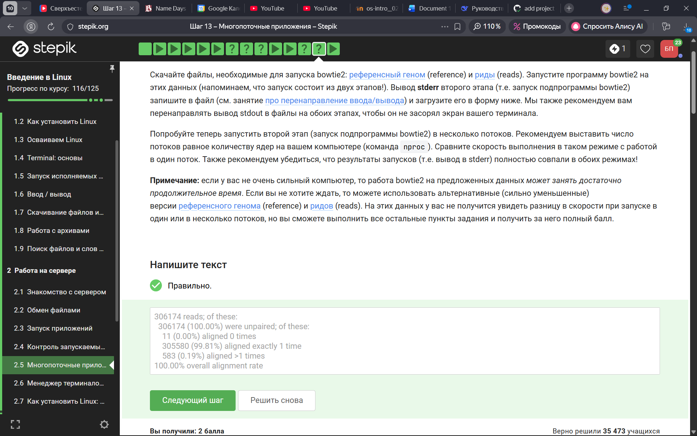{#fig-018 width=70%}

Ответом является текст лога работы bowtie2 (статистика выравнивания), который показывает, сколько ридов было сопоставлено с
 референсом. Это результат работы программы, загружаемый для проверки.

---

Задание 19([рис. @fig-019]).

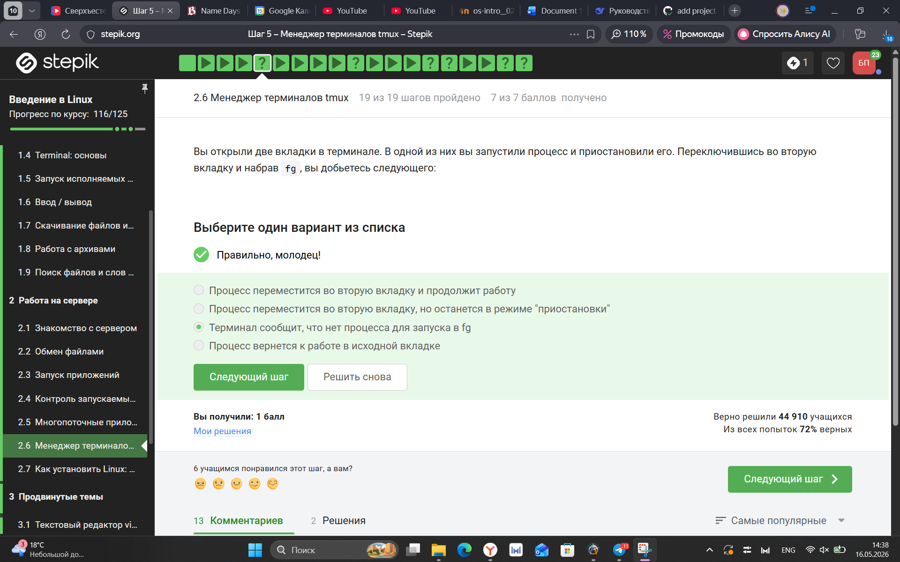{#fig-019 width=70%}

fg — это команда оболочки. Если у вас открыто окно tmux, разделенное на панели, fg вернет процесс в той панели, где вы 
набрали команду. В другой вкладке или панели процесса не будет, поэтому ничего не произойдет (терминал сообщит об ошибке, 
так как процесса для вывода на передний план там нет).

---

Задание 20 ([рис. @fig-020]).

{#fig-020 width=70%}

Когда вы закрываете последнюю вкладку (или панель) в tmux, сам сервер tmux завершает свою работу. Сессия закрывается.

---

Задание 21[рис. @fig-021]).

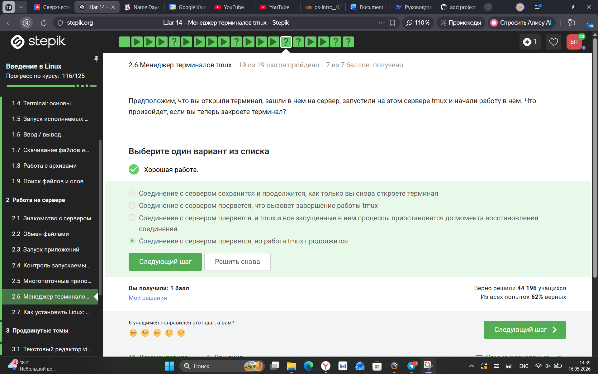{#fig-021 width=70%}

Tmux предназначен для сохранения сессий при разрыве соединения. Если вы закрыли терминал (оболочку), соединение 
с сервером прерывается, но tmux продолжает свою работу на сервере в фоновом режиме. Когда вы зайдете снова, сессия будет активна.

---

Задание 22 [рис. @fig-022]).

{#fig-022 width=70%}

Если процесс запущен в фоновом режиме (с &) в какой-то панели или вкладке tmux, при закрытии этой вкладки (Ctrl+B, X) процесс, 
привязанный к этой вкладке, прерывается и завершается. Вкладка закрывается вместе с процессом.

---

Задание 23[рис. @fig-023]).

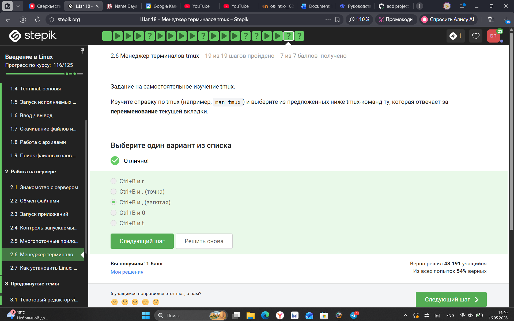{#fig-023 width=70%}

Горячие клавиши в tmux начинаются с префикса (обычно Ctrl+B). Команда для переименования текущей вкладки — это Ctrl+B (префикс), а затем
, (запятая). После этого появится строка ввода для нового имени.

---

Задание 24[рис. @fig-024]).

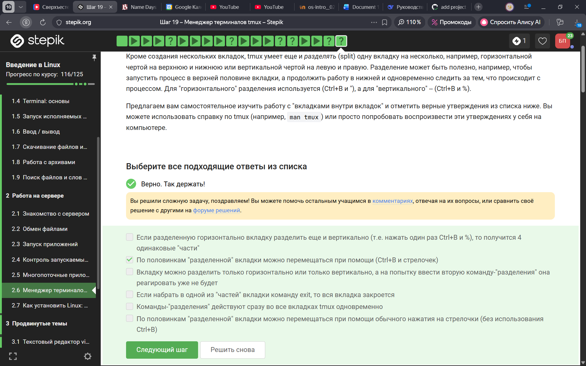{#fig-024 width=70%}

Правильно то, что по половинкам «разделенной» вкладки можно перемещаться при помощи префикса и стрелочек. Другие утверждения 
(например, что при нажатии % повторно вкладка перестанет реагировать) — неверны.

# Выводы

В первом этапе внешнего курса был выполнен блок "Работа на сервере" из курса "Введение в Linux"
