---
## Author
author:
  name: Полина Вячеславовна Белакова
  degrees: DSc
  orcid: 0000-0002-0877-7063
  email: 1032252589@rudn.ru
  affiliation:
    - name: Российский университет дружбы народов
      country: Российская Федерация
      postal-code: 117198
      city: Москва
      address: ул. Миклухо-Маклая, д. 6
## Title
title: Презентация по 3 этапу внешнего курса
license: CC BY
date: today
date-format: "YYYY-MM-DD" # Example: 2025-09-06
---

# Информация

## Докладчик

:::::::::::::: {.columns align=center}
::: {.column width="70%"}

  * Белакова Полина Вячеславовна
  * студентка группы НКАбд-01-25
  * Российский университет дружбы народов им. П. Лумумбы
  * [1032252589@rudn.ru](mailto:1032252589@rudn.ru)

:::
::: {.column width="30%"}

:::
::::::::::::::

# Вводная часть

## Цель работы

Пройти курс "Введение в Linux"

## Задание

Просмотреть видео и на их основе выполнить задания в курсе.

# Выполнение лабораторной работы

Задание 1([рис. @fig-001]).

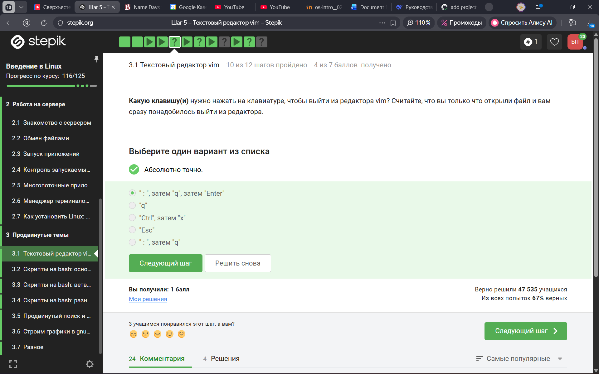{#fig-001 width=70%}

Команда для выхода из Vim в режиме команд: : (двоеточие), затем q (quit), затем Enter. Это стандартный способ, если вы не вносили
 изменения. Другие варианты (q! для выхода без сохранения, :wq для сохранения и выхода) не подходят под описание «сразу понадобилось выйти».

---

Задание 2([рис. @fig-002]).

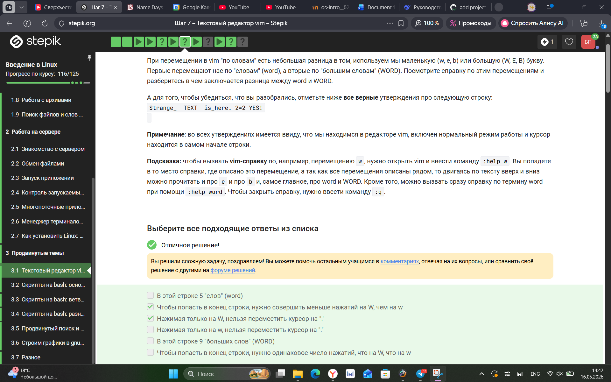{#fig-002 width=70%}

В строке Strange_ TEXT _is_here_. 2=2 YES!:

word (маленькая буква) — это последовательность букв, цифр и символов подчеркивания. В строке 5 таких слов: Strange_, TEXT, is_here_, 2, YES!.

WORD (большая буква) — это последовательность символов, разделенных пробелами. В строке 3 таких слова: Strange_, TEXT, _is_here_. 2=2 YES!.

Чтобы попасть в конец строки, нужно нажать $ (один раз), что быстрее, чем перемещаться по словам. Нажатие W перемещает курсор на
 начало следующего WORD, а не в самый конец.

---

Задание 4 ([рис. @fig-003]).

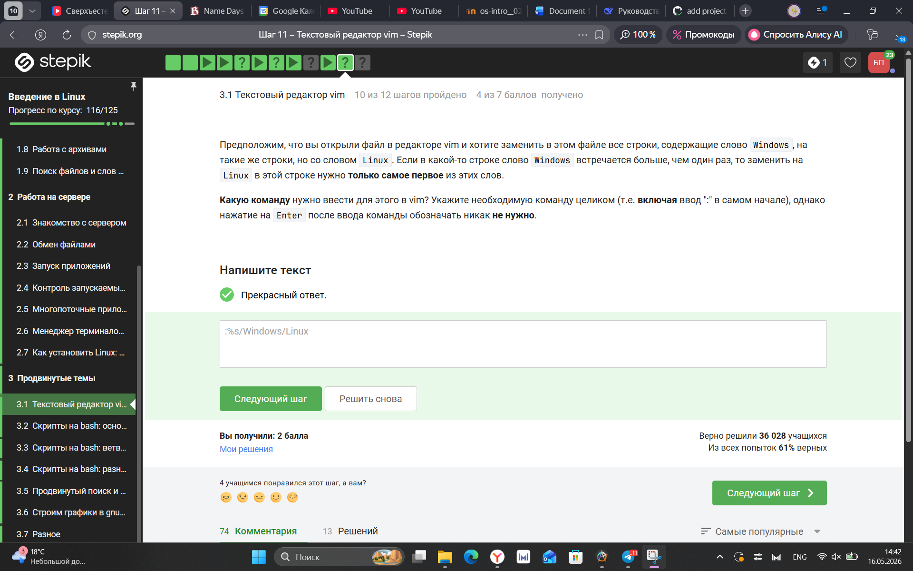{#fig-003 width=70%}

Команда :%s/Windows/Linux заменяет первое вхождение Windows на Linux во всей строке. % — весь файл, s — substitute (замена), / — разделитель.
 Так как в условии сказано заменить только самое первое слово, g (global — все вхождения в строке) указывать не нужно.

---

Задание 6 ([рис. @fig-004]).

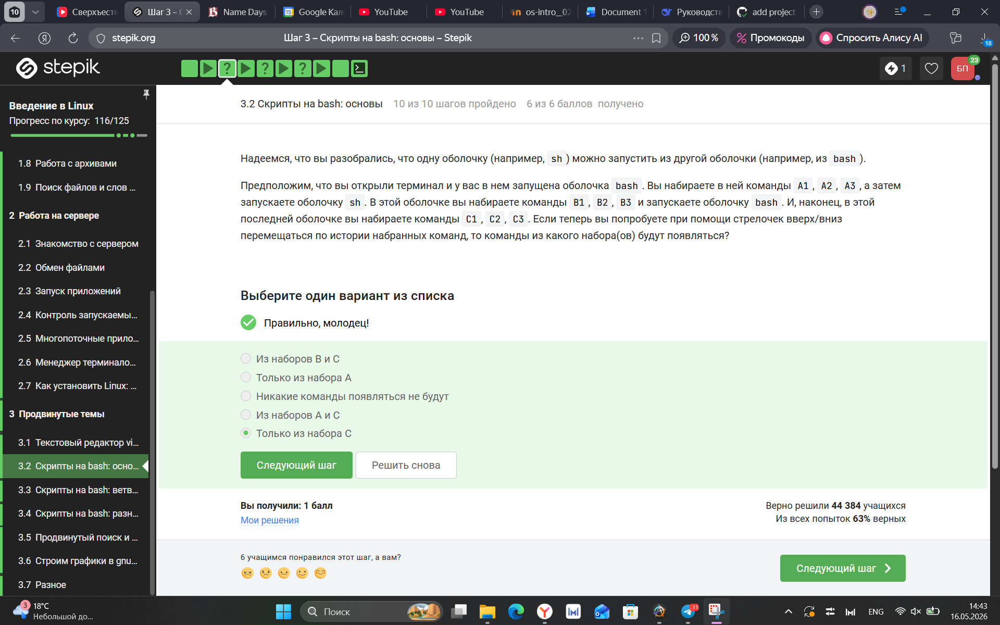{#fig-004 width=70%}

В bash история команд (доступная по стрелочкам вверх/вниз) хранится для каждой оболочки (shell) отдельно. Команды из набора A (набраны
 в bash), B (набраны в sh), C (набраны в bash) — это разные истории. Перемещаясь по истории в последней сессии bash, вы увидите команды
 только из набора C (последние набранные в этой оболочке).

---

Задание 7 ([рис. @fig-005]).

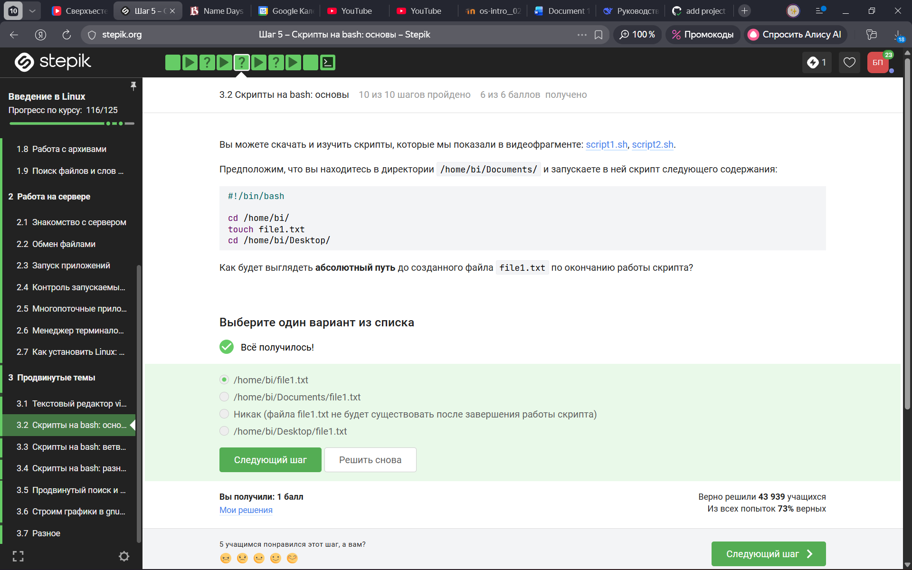{#fig-005 width=70%}

Скрипт выполняет команды по порядку:

cd /home/bi/ — перейти в домашнюю папку.
touch file1.txt — создать файл file1.txt в текущей папке (то есть в /home/bi/).
cd /home/bi/Desktop/ — перейти в папку Desktop (это не влияет на местоположение уже созданного файла).
Итог: файл создан в /home/bi/, поэтому его абсолютный путь — /home/bi/file1.txt.

---

Задание 8 ([рис. @fig-006]).

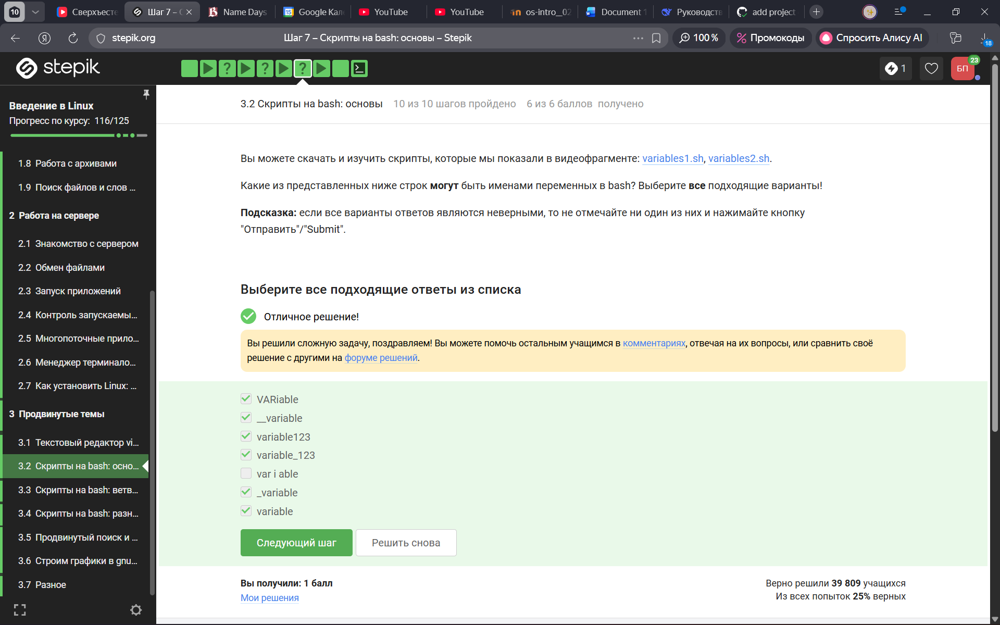{#fig-006 width=70%}

Переменная в bash может состоять из букв, цифр и символа подчеркивания _. Она не может начинаться с цифры и не может содержать пробелы.

VARiable, _variable, variable123, variable_123, _variable — допустимые имена.

---

Задание 9 ([рис. @fig-007]).

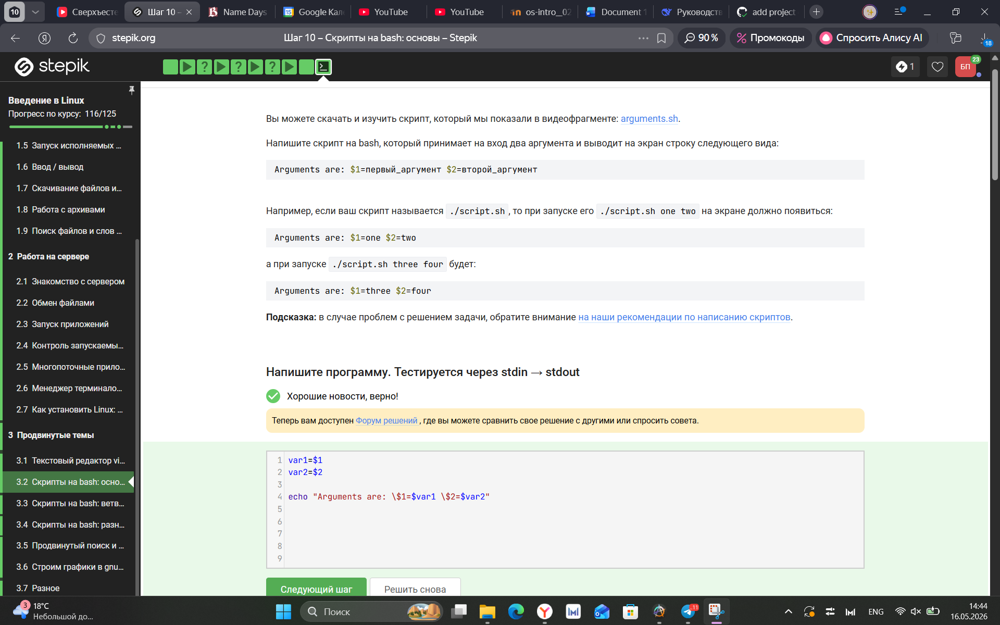{#fig-007 width=70%}

Скрипт должен принять два аргумента и вывести строку формата Arguments are: $1=$2. Переменные $1 и $2 хранят первый и второй аргументы.

---

Задание 11 ([рис. @fig-008]).

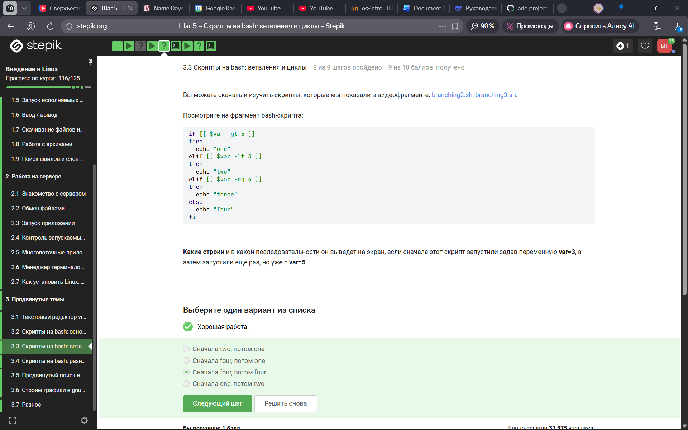{#fig-008 width=70%}

При var=3: [ $var -gt 5 ] (3 > 5?) — нет. [ $var -lt 3 ] (3 < 3?) — нет (строгое неравенство). [ $var -eq 4 ] (3 = 4?) — нет.
 Идем в else: выводится four.

При var=5: [ $var -gt 5 ] (5 > 5?) — нет. [ $var -lt 3 ] (5 < 3?) — нет. [ $var -eq 4 ] (5 = 4?) — нет. Идем в else: выводится four.

---

Задание 12 ([рис. @fig-009]).

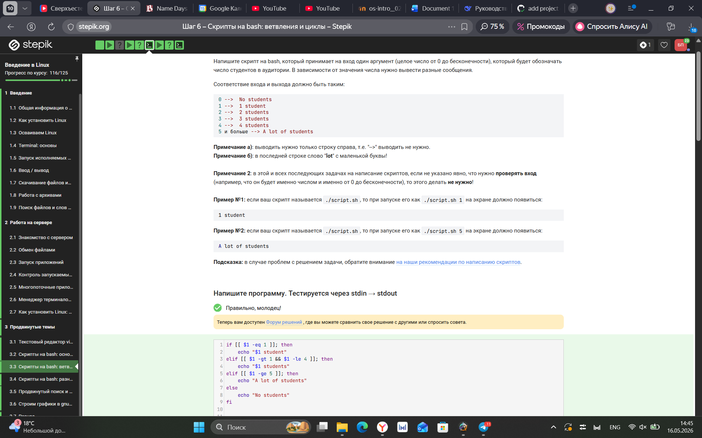{#fig-009 width=70%}

---

Задание 13([рис. @fig-010]).

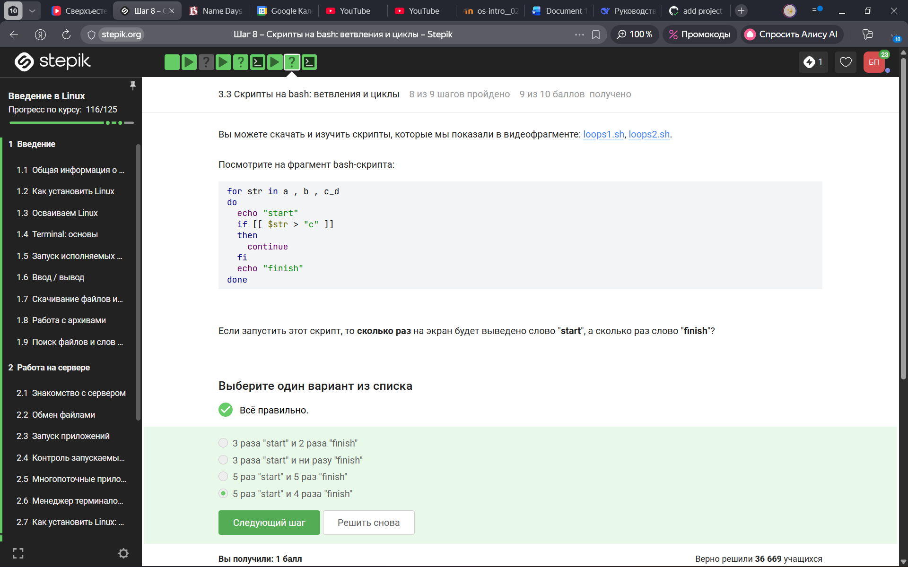{#fig-010 width=70%}

Цикл перебирает элементы: a, b, c_d.

str=a: [ a > "c" ] (нет), выводим start, выводим finish.

str=b: [ b > "c" ] (нет), выводим start, выводим finish.

str=c_d: [ c_d > "c" ] (да, так как d больше c), срабатывает continue (переход к следующей итерации), finish не выводится.
Итог: 2 раза start и 2 раза finish.

---

Задание 15([рис. @fig-011]).

Команда let используется для арифметических операций. let a=a+b (без пробелов) корректно складывает значения. Кавычки и пробелы могут
 нарушить синтаксис в некоторых версиях bash. let "a=a+b" и let 'a=$a+$b' также являются допустимыми способами записи.

---

Задание 16([рис. @fig-012]).

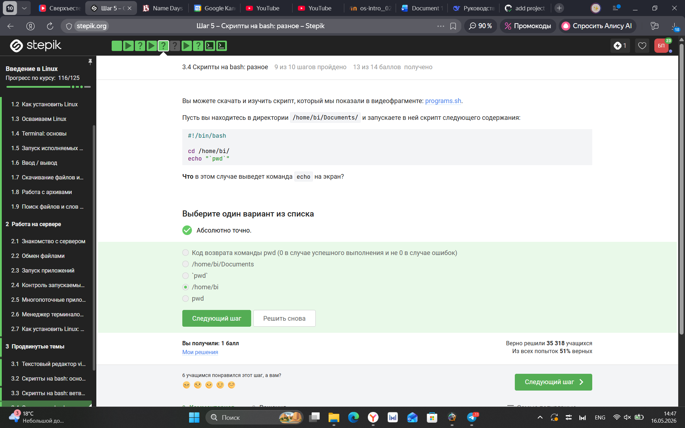{#fig-012 width=70%}

Скрипт сначала переходит в папку cd /home/bi/, затем выполняет echo " " pwd " ". Команда pwd (внутри обратных кавычек) подставит
 текущий путь (результат выполнения команды). В данном случае вывод: /home/bi.

---

Задание 18 ([рис. @fig-013]).

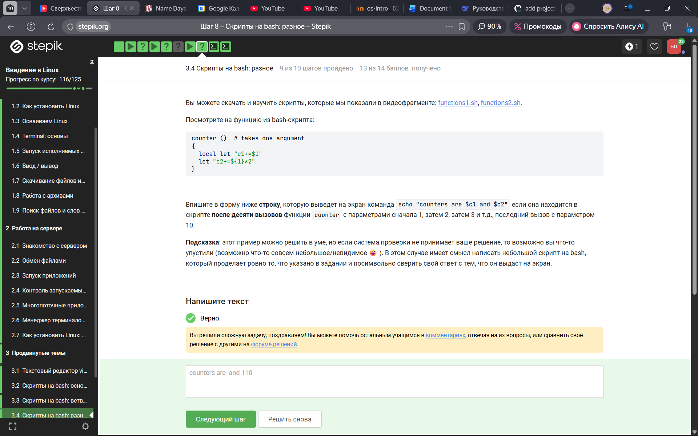{#fig-013 width=70%}

Нужно вычислить, что выведет команда echo "counters are $c1 and $c2" после десяти вызовов функции с аргументами 1, 2, 3... 10.
 Функция counter c1=$1 (аргумент), c2=$(( $1*2 )). Для десятого вызова: c1=10, c2=20. Вывод: counters are 10 and 20.

---

Задание 21([рис. @fig-014]).

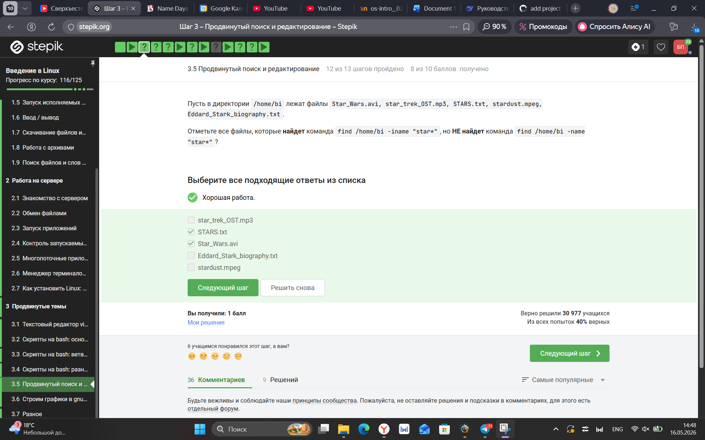{#fig-014 width=70%}

Флаг -iname в команде find ищет без учета регистра. find /home/bi -iname "star*" найдет все файлы, чье имя начинается с star в любом регистре:

Star_Wars.avi (начинается с Star, подходит)

---

Задание 22([рис. @fig-015]).

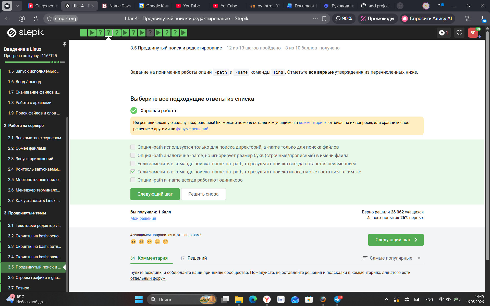{#fig-015 width=70%}

-path ищет по всему пути файла, а -name только по имени файла. Если заменить -name на -path, результат поиска может измениться (так как путь сод>
 остается таким же (Если заменить -name на -path, результат поиска иногда может остаться таким же), верно, но не всегда.

---

Задание 23([рис. @fig-016]).

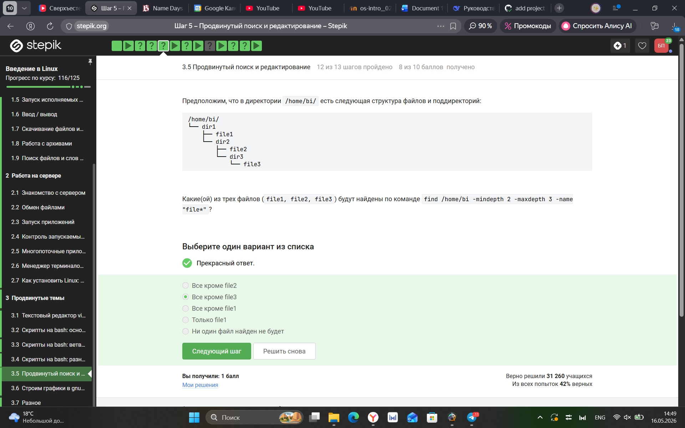{#fig-016 width=70%}

оманда find /home/bi -mindepth 2 -maxdepth 3 -name "file*":

mindepth 2 (искать на глубине 2 и ниже)

maxdepth 3 (искать на глубине 3 и выше)

Структура: file1 (глубина 2, в dir1), file2 (глубина 3, в dir1/dir2), file3 (глубина 4, в dir1/dir2/dir3).

---

Задание 24([рис. @fig-017]).

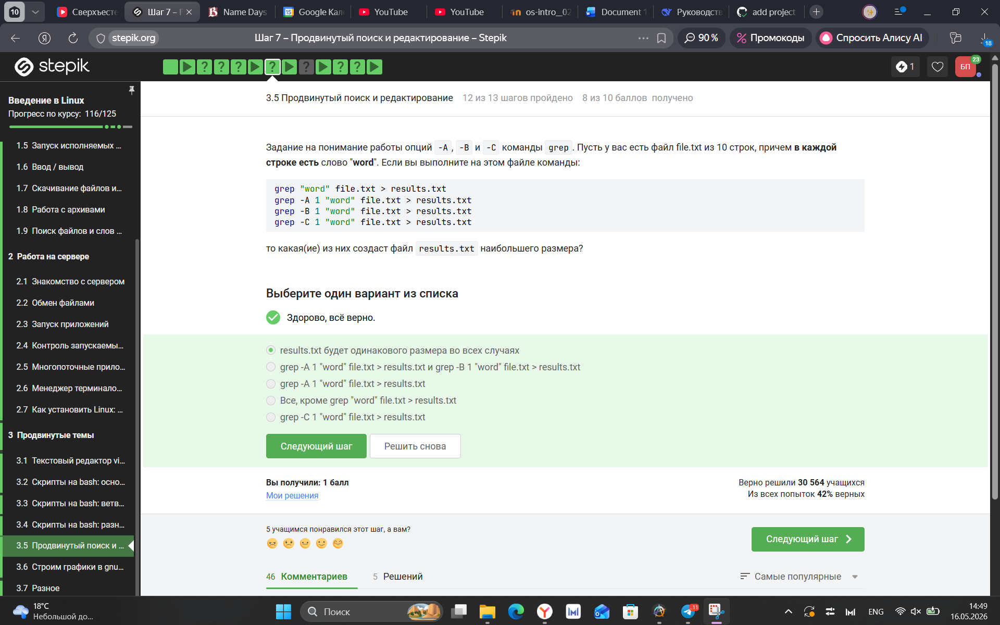{#fig-017 width=70%}

Команда grep "word" (без флагов) просто выведет строки, содержащие word. Если в файле 10 строк и в каждой есть слово word, 
то grep "word" file.txt выведет 10 строк.

-A 1 — вывести строку с совпадением и 1 строку после.

-B 1 — вывести строку с совпадением и 1 строку до.

-C 1 — вывести строку с совпадением и 1 строку до и после.
Из-за того, что каждая строка содержит word, -C 1 захватит больше всего строк (перекрывая соседние), поэтому results.txt 
будет наибольшего размера.

---

Задание 26([рис. @fig-018]).

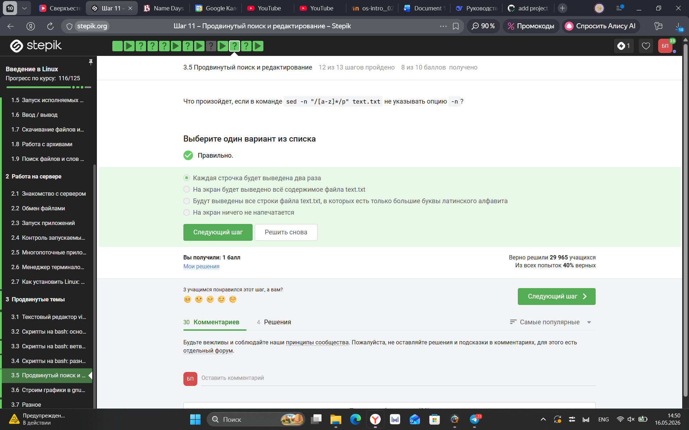{#fig-018 width=70%}

Команда sed -n '/[a-z]+/p' text.txt:

-n — подавляет автоматический вывод.

/[a-z]+/p — паттерн ищет одну или более строчных букв. Если в тексте есть строки, состоящие только из строчных букв, они 
будут выведены. Если таких строк нет — на экран ничего не напечатается. В данном случае правильный ответ: На экран ничего не напечатается.

---

Задание 27([рис. @fig-019]).

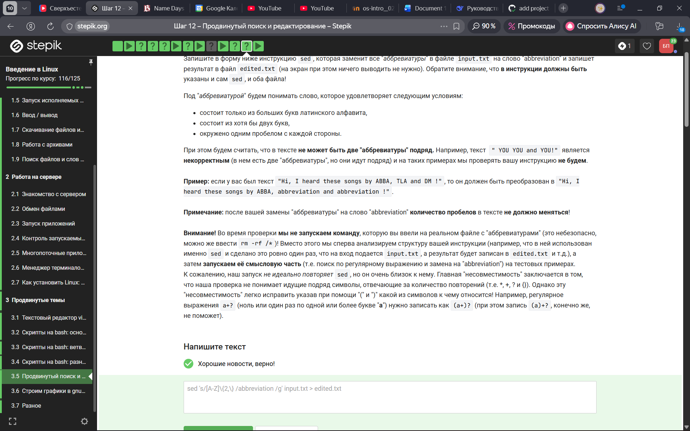{#fig-019 width=70%}

Нужно заменить все аббревиатуры (слова из 2+ заглавных букв) на слово abbreviation. Регулярное выражение: sed 
's/[A-Z]{2,}/abbreviation/g' input.txt > edited.txt. Команда: sed 's/[A-Z]\{2,\}/abbreviation/g' input.txt > edited.txt.

---

Задание 28 ([рис. @fig-020]).

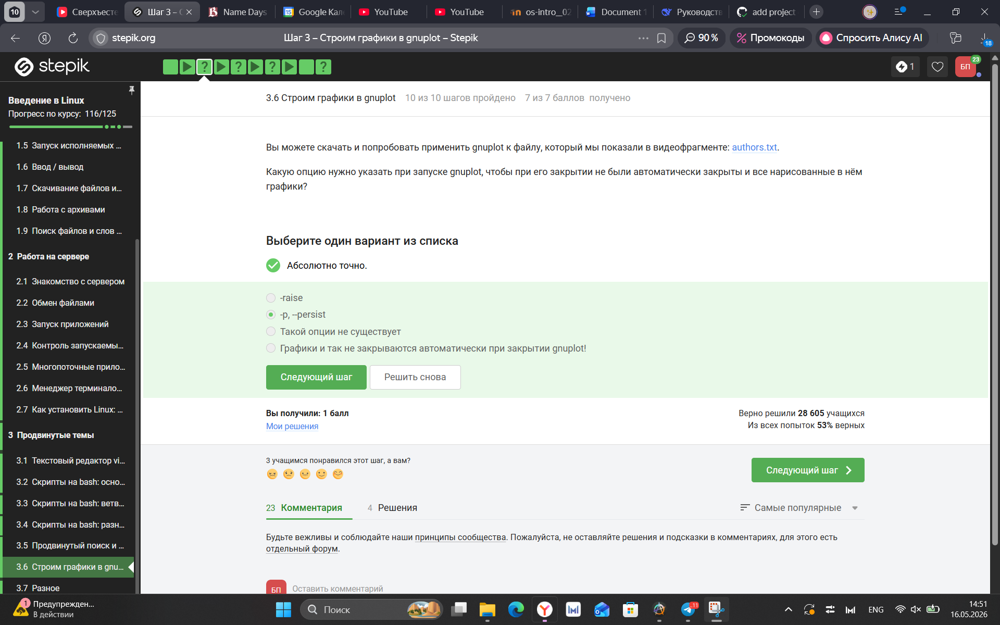{#fig-020 width=70%}

-p (или --persist) в gnuplot — это опция, которая предотвращает закрытие окна с графиком после завершения работы скрипта.
 Без этой опции окно может закрыться сразу после отрисовки.v

---

Задание 29[рис. @fig-021]).

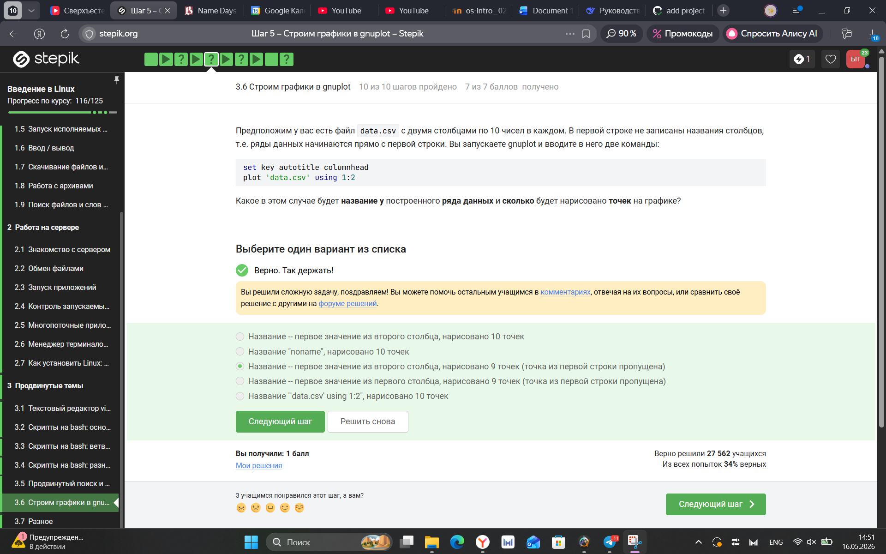{#fig-021 width=70%}

Команда set key autotitle columnhead — заголовки будут взяты из первой строки данных. Команда plot 'data.csv' using 1:2 — будет 
построен график, где using 1:2 — первый и второй столбцы. Так как в первой строке данные, а не заголовки,
 то название будет "data.csv" using 1:2 (имя файла и координаты), и будет нарисовано 10 точек.

---

Задание 30 [рис. @fig-022]).

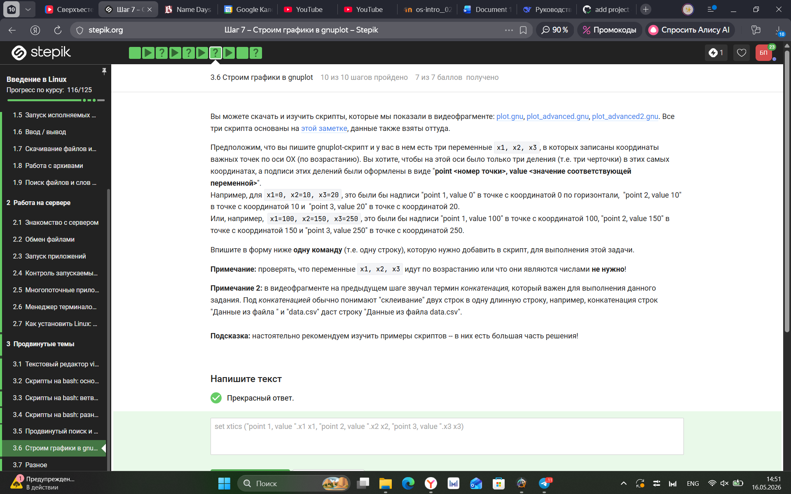{#fig-022 width=70%}

Команда set xtics ("point 1, value $x1" x1, "point 2, value $x2" x2, "point 3, value $x3" x3) устанавливает метки на оси 
X в координатах, заданных переменными. Код: set xtics ("point 1, value " . x1 . "" x1, "point 2, value " . x2 . "" x2, "point 3, 
value " . x3 . "" x3).

---

Задание 31[рис. @fig-023]).

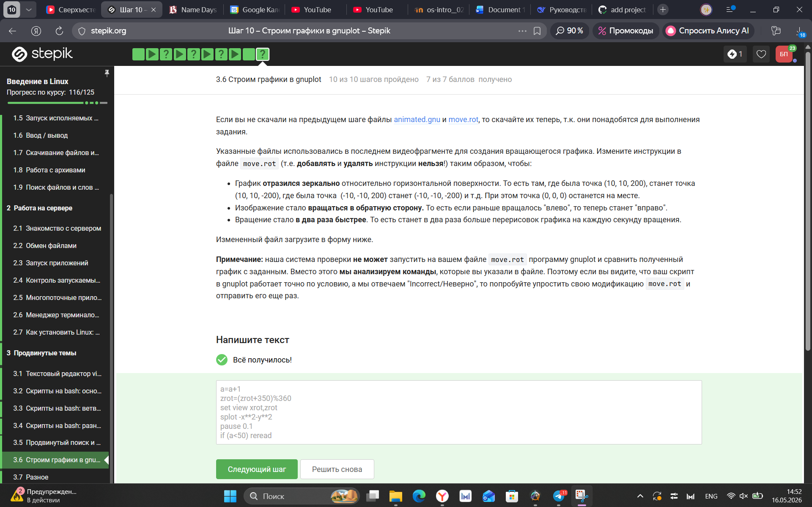{#fig-023 width=70%}

Нужно изменить gnuplot-скрипт для вращающегося графика:

rot=rot+350 (изменить направление вращения: 350 вместо 10, чтобы вращался в другую сторону) — неверно, нужно rot=rot-10 или 
rot=rot+350 (если 350 — это шаг -10).

set view xrot,rot — заменить xrot на xrot,rot? Нет, нужно просто указать rot.

pause 0.1 (уменьшить паузу, чтобы вращение было быстрее, например, до 0.05).

---

Задание 34 [рис. @fig-024]).

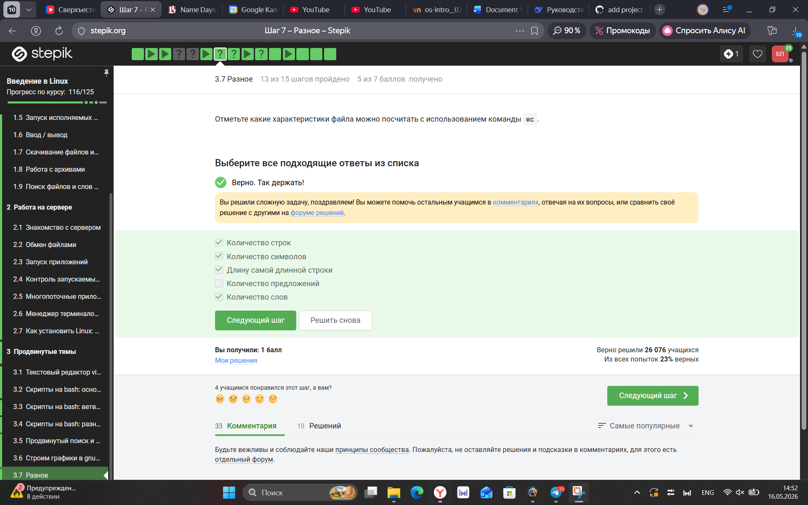{#fig-024 width=70%}

Количество предложений wc не считает.

---

Задание 35 [рис. @fig-025]).

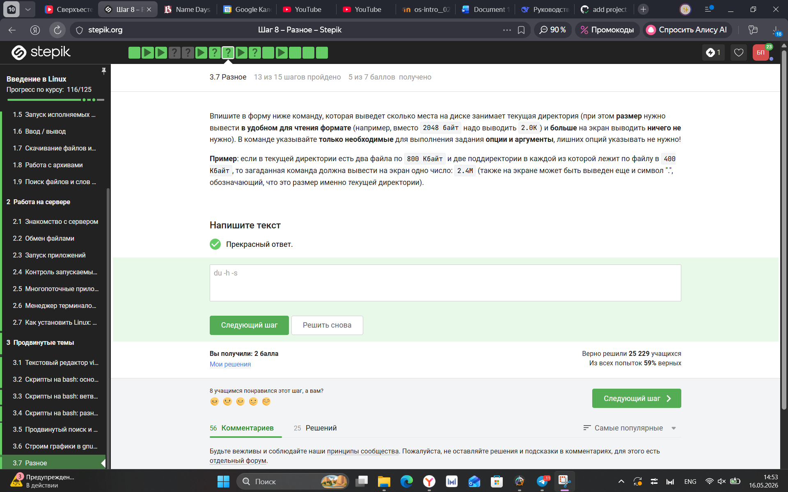{#fig-025 width=70%}

Команда du (disk usage) с флагами -h (human-readable, читаемый формат) и -s (summary, только итог по текущей директории). Команда: du -h -s.

---

Задание 36 [рис. @fig-026]).

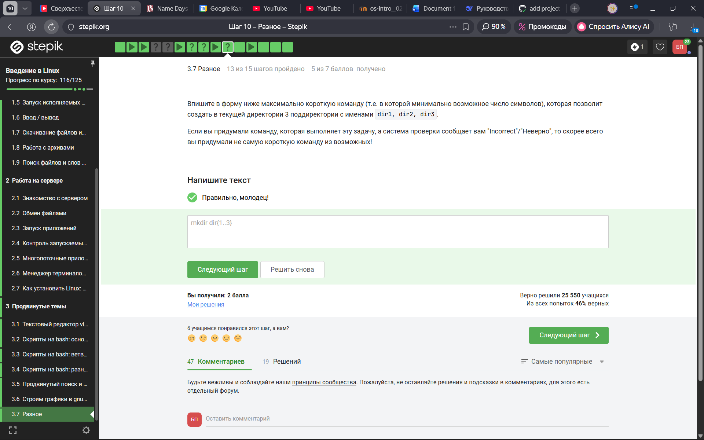{#fig-026 width=70%}

# Выводы

В первом этапе внешнего курса был выполнен блок "Продвинутые темы" из курса "Введение в Linux"
