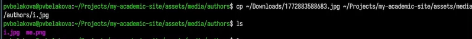
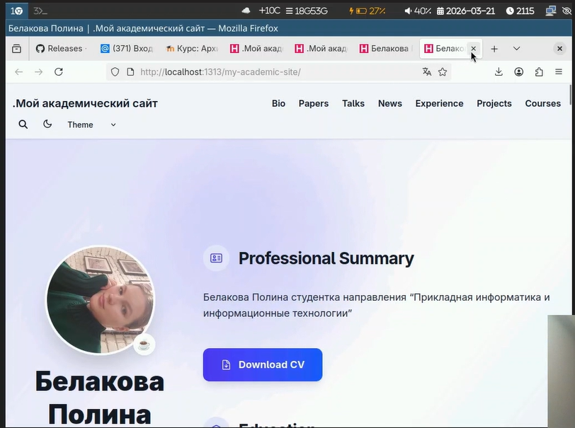
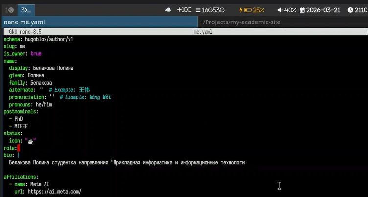
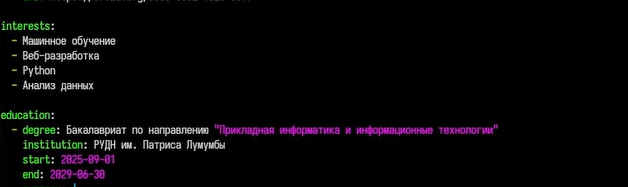
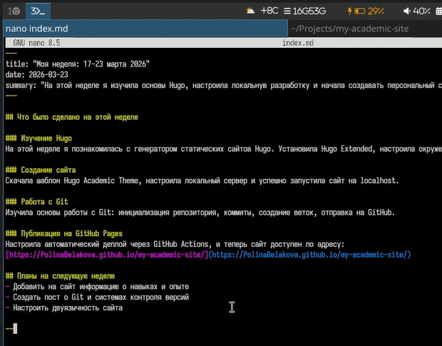
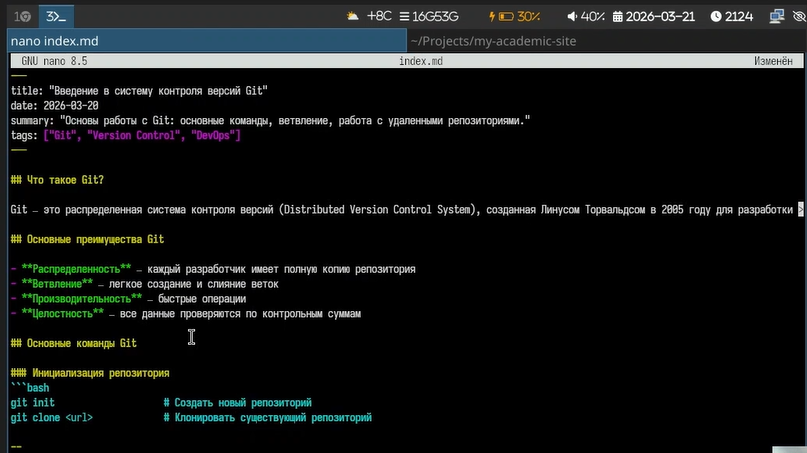

---
## Author
author:
  name: Полина Вячеславовна Белакова
  degrees: DSc
  orcid: 0000-0002-0877-7063
  email: 1032252589@rudn.ru
  affiliation:
    - name: Российский университет дружбы народов
      country: Российская Федерация
      postal-code: 117198
      city: Москва
      address: ул. Миклухо-Маклая, д. 6

## Title
title: "Отчёта по выполнению второго этапа индивидуального проекта"
license: "CC BY"
---

# Цель работы

Добавить к сайту данные о себе и сделать два поста.

# Задание

Разместить фотографию владельца сайта.Разместить краткое описание владельца сайта. Добавить информацию об интересах. Добавить информацию от образовании.
Сделать пост по прошедшей неделе и по управлению версиями, Git.

# Выполнение лабораторной работы

## Добавить к сайту данные о себе.

Размещаю фотографию на сайта, для этого копирую фотографию в папку assets/media/authours ([рис. @fig-001]), ([рис. @fig-002]).

{#fig-001 width=70%}

{#fig-002 width=70%}

Добавляю краткое описание (Biography) и  информацию об интересах (Interests) в файл me.yaml ([рис. @fig-003])

{#fig-003 width=70%}

Добавляю информацию от образовании (Education).([рис. @fig-004])

{#fig-004 width=70%}

В папке blog создаю пост по прошедшей неделе ([рис. @fig-005])

{#fig-005 width=70%}

И добавляю пост на тему управление версиями. Git. ([рис. @fig-006])

{#fig-006 width=70%}

# Выводы

На сайте были Размещены фотография, краткое описание владельца сайта, информацию об интересах, информацию от образовании.
Сделаны посты по прошедшей неделе и по управлению версиями, Git.

# Список литературы{.unnumbered}

::: {#refs}
:::
