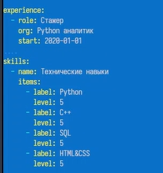
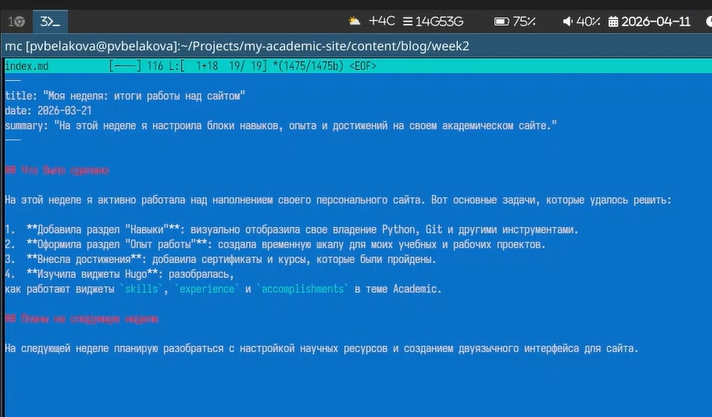
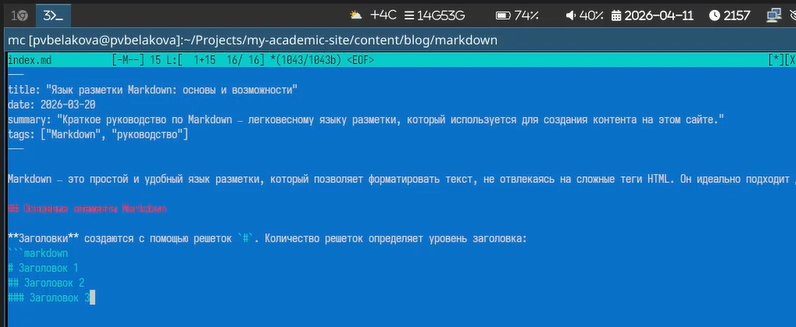

---
## Author
author:
  name: Полина Вячеславовна Белакова
  degrees: DSc
  orcid: 0000-0002-0877-7063
  email: 1032252589@rudn.ru
  affiliation:
    - name: Российский университет дружбы народов
      country: Российская Федерация
      postal-code: 117198
      city: Москва
      address: ул. Миклухо-Маклая, д. 6

## Title
title: "Отчёт по 3 этапу индивидуального проекта"
license: "CC BY"
---

# Цель работы

- Добавить к сайту достижения.
- Сделать пост по прошедшей неделе.
- Добавить пост на тему Язык разметки Markdown.

# Задание

- Добавить к сайту достижения.
- Сделать пост по прошедшей неделе.
- Добавить пост на тему Язык разметки Markdown.

# Выполнение лабораторной работы

Добавляю к сайту достижения.([рис. @fig-001]).

{#fig-001 width=70%}

Создаю пост по прошедшей неделе.[рис. @fig-002]).

{#fig-002 width=70%}

Создаю пост на тему Язык разметки Markdown.([рис. @fig-003]).

{#fig-003 width=70%}

# Выводы

Были добавлены к сайту достижения. Сделаны посты по прошедшей неделе и о языке разметки Markdown.

# Список литературы{.unnumbered}

::: {#refs}
:::
