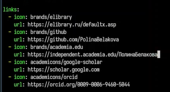
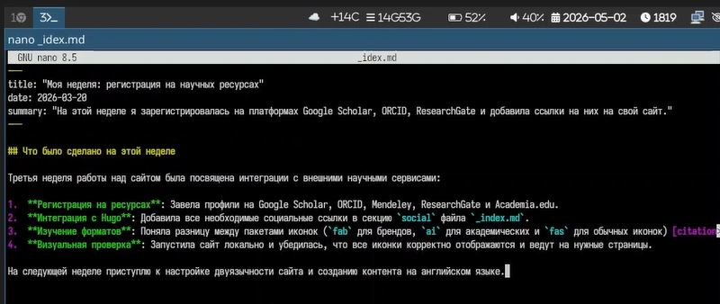
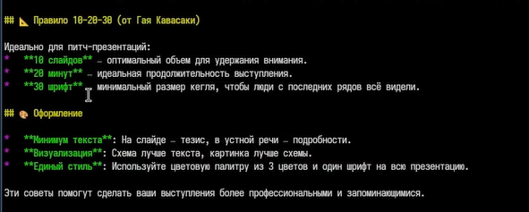

---
## Author
author:
  name: Полина Вячеславовна Белакова
  degrees: DSc
  orcid: 0000-0002-0877-7063
  email: 1032252589@rudn.ru
  affiliation:
    - name: Российский университет дружбы народов
      country: Российская Федерация
      postal-code: 117198
      city: Москва
      address: ул. Миклухо-Маклая, д. 6

## Title
title: "Индивидуальный проект 4"
license: "CC BY"
---

# Цель работы

- Зарегистрироваться на соответствующих ресурсах и разместить на них ссылки на сайте:
        - eLibrary : https://elibrary.ru/;
        - Google Scholar : https://scholar.google.com/;
        - ORCID : https://orcid.org/;
        - Mendeley : https://www.mendeley.com/;
        - ResearchGate : https://www.researchgate.net/;
        - Academia.edu : https://www.academia.edu/;
        - arXiv : https://arxiv.org/;
        - github : https://github.com/.
 - Сделать пост по прошедшей неделе.
 - Добавить пост на тему "Создание презентаций".

# Задание

 - Зарегистрироваться на ресурсах и разместить на них ссылки на сайте
 - Сделать пост по прошедшей неделе.
 - Добавить пост на тему "Создание презентаций".

# Выполнение лабораторной работы

Регистрируюсь на соответствующих ресурсах и размещаю на них ссылки на сайте ([рис. @fig-001]).

{#fig-001 width=70%}

Создаю пост по прошедшей неделе([рис. @fig-002]).

{#fig-002 width=70%}

Добавляю пост на тему "Создание презентаций"([рис. @fig-003]).

{#fig-003 width=70%}

# Выводы

 - Зарегистрировалась на ресурсах и разместила на них ссылки на сайте
 - Сделала пост по прошедшей неделе.
 - Добавила пост на тему "Создание презентаций".

# Список литературы{.unnumbered}

::: {#refs}
:::
